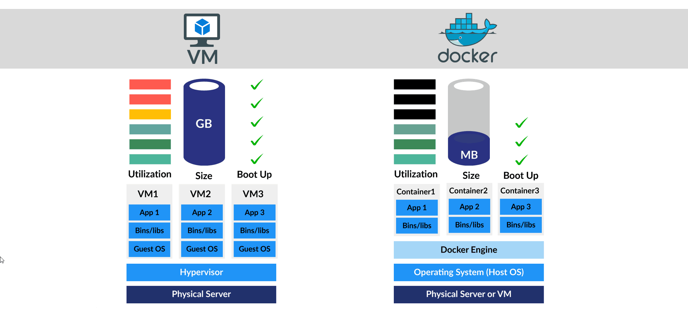

## Nipa Training Systemadmin

Compare VM and Container

The Container as a Complete Runtime Package
Containers bundle applications with all their dependencies - including language runtimes like Node.js, Go, or .NET Core - into self-contained, portable units. This represents a fundamental shift from traditional deployment models.

Key benefits:
- No "it works on my machine" issues
- prevent conflict Node.js runtime
- Isolated dependency tree

[0 Docker Architecture](./container/architecture.md)

# Workshop

[1 Install Docker on Ubuntu 24.04](./container/install-docker.md)  
install docker container on Ubuntu 24.04

[2 Docker Volume](./container/volume.md)  
Understand Docker Volume

[3 Docker file and application](./container/dockerfile-explain.md)  
Pack application in container by Dockerfile

[4 Docker Port forword](./container/docker-port.md)
Access to container process by forword port
