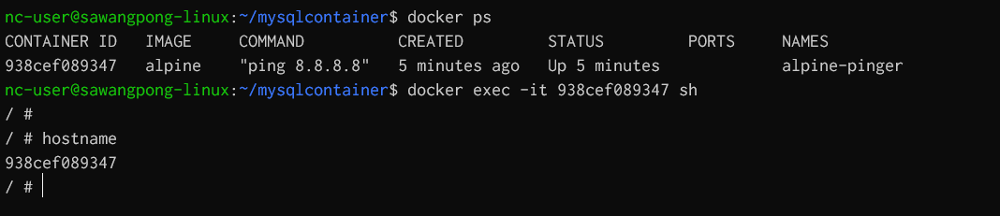
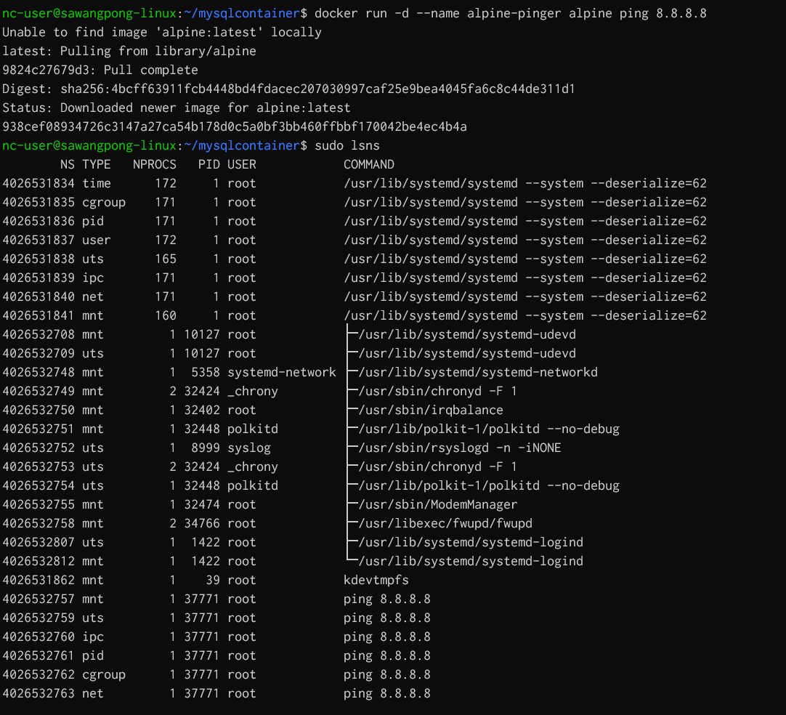
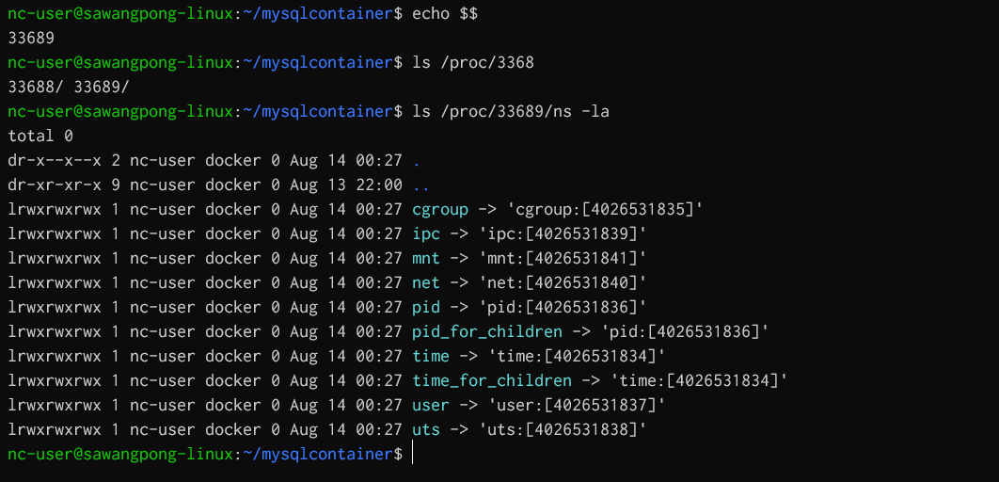
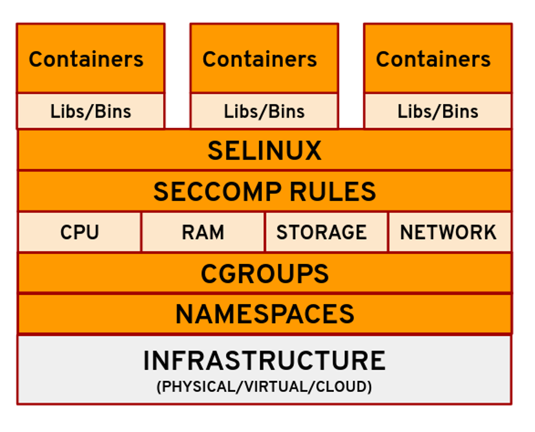

# Docker Architecture
[https://opensource.com/article/21/8/container-linux-technology](https://opensource.com/article/21/8/container-linux-technology)

Docker containers achieve process isolation primarily through the use of Linux kernel features, specifically namespaces and cgroups (control groups).
### Namespaces:
Namespaces provide isolated views of system resources for each container. Docker leverages several types of namespaces to achieve this:
- `PID Namespace:` Isolates process IDs, so processes inside a container only see other processes within that same container and have their own independent PID 1.
- `User Namespace:` Maps user IDs and group IDs, allowing a user in a container to be treated as root within the container while being mapped to a non-privileged user on the host.
- `Mount Namespace:` Creates an isolated filesystem view, preventing containers from seeing or modifying the host's filesystem or other containers' filesystems unless explicitly shared.
- `Network Namespace:` Provides each container with its own network stack, including network interfaces, IP addresses, routing tables, and firewall rules, independent of the host and other containers.
- `IPC Namespace:` Isolates Interprocess Communication (IPC) resources like message queues and shared memory segments. (IPC) namespace allows different container processes to communicate by accessing a shared range of memory or using a shared message queue
- `UTS Namespace:` Isolates the hostname and domain name, allowing each container to have its own hostname.  (UTS) namespace allows containers to have a unique hostname and domain name. 


###  Check Namespace of container
```
nc-user@sawangpong-linux:~/mysqlcontainer$ echo $$
33689
nc-user@sawangpong-linux:~/mysqlcontainer$ ls /proc/3368
33688/ 33689/
nc-user@sawangpong-linux:~/mysqlcontainer$ ls /proc/33689/ns -la

```
- Example use linux command `lsns`
```
$ sudo lsns
        NS TYPE   NPROCS   PID USER            COMMAND
4026531834 time      172     1 root            /usr/lib/systemd/systemd --system --deserialize=62
4026531835 cgroup    172     1 root            /usr/lib/systemd/systemd --system --deserialize=62
4026531836 pid       172     1 root            /usr/lib/systemd/systemd --system --deserialize=62
4026531837 user      172     1 root            /usr/lib/systemd/systemd --system --deserialize=62
4026531838 uts       166     1 root            /usr/lib/systemd/systemd --system --deserialize=62
4026531839 ipc       172     1 root            /usr/lib/systemd/systemd --system --deserialize=62
4026531840 net       172     1 root            /usr/lib/systemd/systemd --system --deserialize=62
4026531841 mnt       161     1 root            /usr/lib/systemd/systemd --system --deserialize=62
4026532708 mnt         1 10127 root            ├─/usr/lib/systemd/systemd-udevd
4026532709 uts         1 10127 root            ├─/usr/lib/systemd/systemd-udevd
4026532748 mnt         1  5358 systemd-network ├─/usr/lib/systemd/systemd-networkd
4026532749 mnt         2 32424 _chrony         ├─/usr/sbin/chronyd -F 1
4026532750 mnt         1 32402 root            ├─/usr/sbin/irqbalance
4026532751 mnt         1 32448 polkitd         ├─/usr/lib/polkit-1/polkitd --no-debug
4026532752 uts         1  8999 syslog          ├─/usr/sbin/rsyslogd -n -iNONE
4026532753 uts         2 32424 _chrony         ├─/usr/sbin/chronyd -F 1
4026532754 uts         1 32448 polkitd         ├─/usr/lib/polkit-1/polkitd --no-debug
4026532755 mnt         1 32474 root            ├─/usr/sbin/ModemManager
4026532758 mnt         2 34766 root            ├─/usr/libexec/fwupd/fwupd
4026532807 uts         1  1422 root            ├─/usr/lib/systemd/systemd-logind
4026532812 mnt         1  1422 root            └─/usr/lib/systemd/systemd-logind
4026531862 mnt         1    39 root            kdevtmpfs
```

Try run docker in background
```
docker run -d --name alpine-pinger alpine ping 8.8.8.8
sudo lsns
```



## Simple command to list linux namespace:


## 4 Linux technologies fundamental to container



### Control Groups (cgroups):
Cgroups limit and allocate system resources (CPU, memory, I/O, network bandwidth) to containers. This prevents a single container from monopolizing host resources and affecting the performance of other containers or the host system.
In addition to these Linux-specific mechanisms, Docker also employs other techniques for isolation:

### Union File Systems:
Docker uses copy-on-write file systems (like OverlayFS, AUFS, etc.) to create container layers. This allows multiple containers to share common base image layers efficiently while providing each container with a writable layer for its own modifications, ensuring changes are isolated.

### Seccomp (Secure Computing Mode):
Seccomp filters system calls that a container can make, reducing the attack surface by limiting the kernel functionalities available to a container.

### AppArmor/SELinux:
These are Linux security modules that provide mandatory access control (MAC) policies, further restricting what processes within a container can do.