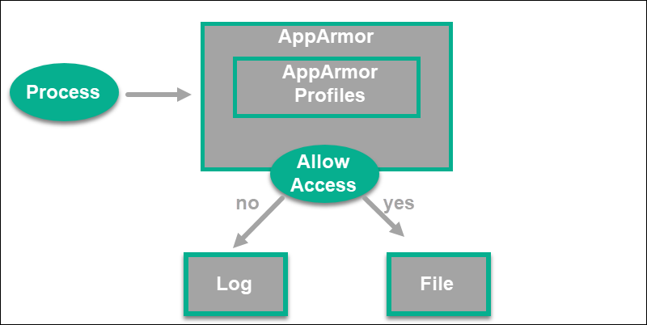
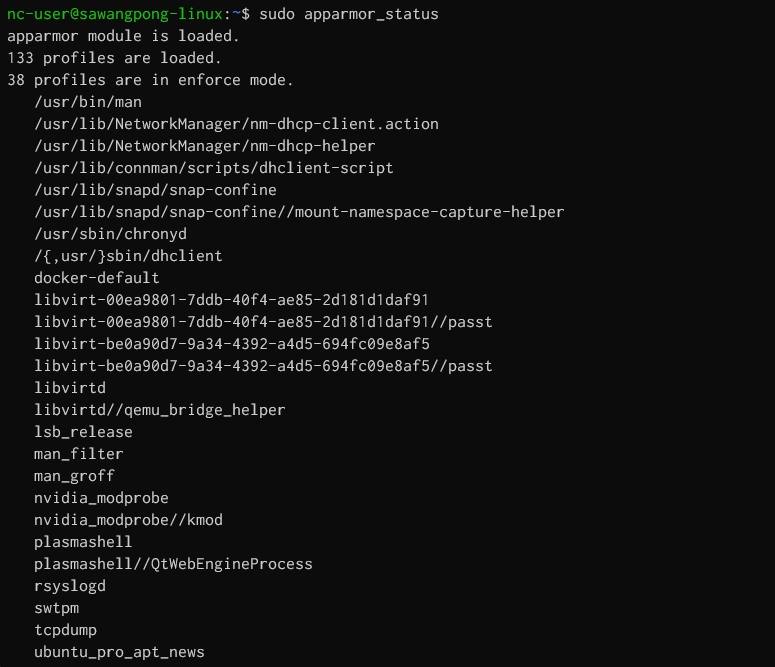
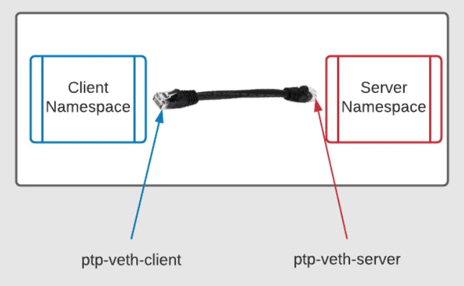

# Docker Architecture
[https://opensource.com/article/21/8/container-linux-technology](https://opensource.com/article/21/8/container-linux-technology)

Docker containers achieve process isolation primarily through the use of Linux kernel features, specifically namespaces and cgroups (control groups).


### Namespaces:
Namespaces provide isolated views of system resources for each container. Docker leverages several types of namespaces to achieve this:
- `PID Namespace:` Isolates process IDs, so processes inside a container only see other processes within that same container and have their own independent PID 1.

```
## Create IP namespace
sudo ip netns add my_namespace

## Verify IP namespace
ip netns

## Execute a command within namespace
sudo ip netns exec my_namespace ip link show

## Delete a network delete my_namespace
sudo ip netns delete my_namespace
```

- `User Namespace:` Maps user IDs and group IDs, allowing a user in a container to be treated as root within the container while being mapped to a non-privileged user on the host.
- `Mount Namespace:` Creates an isolated filesystem view, preventing containers from seeing or modifying the host's filesystem or other containers' filesystems unless explicitly shared.
- `Network Namespace:` Provides each container with its own network stack, including network interfaces, IP addresses, routing tables, and firewall rules, independent of the host and other containers.
- `IPC Namespace:` Isolates Interprocess Communication (IPC) resources like message queues and shared memory segments. (IPC) namespace allows different container processes to communicate by accessing a shared range of memory or using a shared message queue
- `UTS Namespace:` Isolates the hostname and domain name, allowing each container to have its own hostname.  (UTS) namespace allows containers to have a unique hostname and domain name. 


###  Check Namespace of container
```
nc-user@sawangpong-linux:~/mysqlcontainer$ echo $$
33689
nc-user@sawangpong-linux:~/mysqlcontainer$ ls /proc/3368
33688/ 33689/
nc-user@sawangpong-linux:~/mysqlcontainer$ ls /proc/33689/ns -la

```
- Example use linux command `lsns`
```
$ sudo lsns
        NS TYPE   NPROCS   PID USER            COMMAND
4026531834 time      172     1 root            /usr/lib/systemd/systemd --system --deserialize=62
4026531835 cgroup    172     1 root            /usr/lib/systemd/systemd --system --deserialize=62
4026531836 pid       172     1 root            /usr/lib/systemd/systemd --system --deserialize=62
4026531837 user      172     1 root            /usr/lib/systemd/systemd --system --deserialize=62
4026531838 uts       166     1 root            /usr/lib/systemd/systemd --system --deserialize=62
4026531839 ipc       172     1 root            /usr/lib/systemd/systemd --system --deserialize=62
4026531840 net       172     1 root            /usr/lib/systemd/systemd --system --deserialize=62
4026531841 mnt       161     1 root            /usr/lib/systemd/systemd --system --deserialize=62
4026532708 mnt         1 10127 root            ├─/usr/lib/systemd/systemd-udevd
4026532709 uts         1 10127 root            ├─/usr/lib/systemd/systemd-udevd
4026532748 mnt         1  5358 systemd-network ├─/usr/lib/systemd/systemd-networkd
4026532749 mnt         2 32424 _chrony         ├─/usr/sbin/chronyd -F 1
4026532750 mnt         1 32402 root            ├─/usr/sbin/irqbalance
4026532751 mnt         1 32448 polkitd         ├─/usr/lib/polkit-1/polkitd --no-debug
4026532752 uts         1  8999 syslog          ├─/usr/sbin/rsyslogd -n -iNONE
4026532753 uts         2 32424 _chrony         ├─/usr/sbin/chronyd -F 1
4026532754 uts         1 32448 polkitd         ├─/usr/lib/polkit-1/polkitd --no-debug
4026532755 mnt         1 32474 root            ├─/usr/sbin/ModemManager
4026532758 mnt         2 34766 root            ├─/usr/libexec/fwupd/fwupd
4026532807 uts         1  1422 root            ├─/usr/lib/systemd/systemd-logind
4026532812 mnt         1  1422 root            └─/usr/lib/systemd/systemd-logind
4026531862 mnt         1    39 root            kdevtmpfs
```

Try run docker in background
```
docker run -d --name alpine-pinger alpine ping 8.8.8.8
sudo lsns
```


## Simple command to list linux namespace:


## 4 Linux technologies fundamental to container


### Control Groups (cgroups):
Cgroups limit and allocate system resources (CPU, memory, I/O, network bandwidth) to containers. This prevents a single container from monopolizing host resources and affecting the performance of other containers or the host system.
In addition to these Linux-specific mechanisms, Docker also employs other techniques for isolation:

### Union File Systems:
Docker uses copy-on-write file systems (like OverlayFS, AUFS, etc.) to create container layers. This allows multiple containers to share common base image layers efficiently while providing each container with a writable layer for its own modifications, ensuring changes are isolated.

### Seccomp (Secure Computing Mode):
Seccomp filters system calls that a container can make, reducing the attack surface by limiting the kernel functionalities available to a container.

### AppArmor/SELinux:
These are Linux security modules that provide mandatory access control (MAC) policies, further restricting what processes within a container can do.

Note: mandatory access control (MAC) policies,

Mandatory Access Control (MAC) systems, like AppArmor and SELinux, allow sysadmins to grant or deny access to resources and control systems built into the Linux kernel. While both perform the same tasks, these systems work differently and offer various features.



```
sudo apparmor_status
```


## Workshop ip namespace
[https://www.redhat.com/en/blog/net-namespaces](https://www.redhat.com/en/blog/net-namespaces)


- 1 Create environment variable

```
$ cat << EOF >> vars
namespace1=client
namespace2=server
command='python3 -m http.server'
ip_address1="10.10.10.10/24"
ip_address2='10.10.10.20/24'
interface1=veth-client
interface2=veth-server
EOF
$ . vars
```

- 2 Create namespace, First create use `ip netns add ` command
```
sudo ip netns add $namespace1
sudo ip netns add $namespace2
```  

- 3 Verify that namespace 
```
$ ip netns list
```

- 4 Namespace status  
  If you run a command in one of the new namespaces, you see that there is only the loopback address, and it is marked as DOWN:
```
$ sudo ip netns exec $namespace2 ip a
```
- 5 next step is to create the virtual "Ethernet cable" by creating a link between the two namespaces, like this:
  
```
sudo ip link add \
       ptp-$interface1 \
       type veth \
       peer name ptp-$interface2
```
- 6 Run `ip link command on host` you'll see two additional links created by this command:
```
$ ip link
```
it created a link with the following convention:` <link name>@<peer link name>`

- 7 At this point, you have created the links but have not assigned them anywhere. Go ahead and assign the interfaces to their respective namespaces:

```
sudo ip link set ptp-$interface1 netns $namespace1
sudo ip link set ptp-$interface2 netns $namespace2
```

- 8 After running this command, the host no longer has access to these links because they are assigned to a different net namespace. If you rerun the ip netns exec command, you can see that your new namespaces have devices, but they are still marked as DOWN and do not have IP addresses to communicate with:
```
$ sudo ip netns exec $namespace2 ip ad
```
- 9 Next, assign the IPs and bring the interfaces up:

```
sudo ip netns exec $namespace1 ip addr \
     add $ip_address1 dev ptp-$interface1
sudo ip netns exec $namespace2 ip addr \
     add $ip_address2 dev ptp-$interface2
sudo ip netns exec $namespace1 ip link set \
     dev ptp-$interface1 up
sudo ip netns exec $namespace2 ip link set \
     dev ptp-$interface2 up
```

- 10 Finally, start the Python 3 web server in $namespace2 and test it:
```
sudo ip netns exec $namespace2 $command &
```
- Because you have the subnet CIDR in the $ip_addres2, you have options. You can do some Bash trickery to remove it:

```
sudo ip netns exec $namespace1 curl `echo $ip_address2 |awk -F '/' '{print $1}'`:8000
```

- Or you can simply type the IP address into the command:
```
sudo ip netns exec $namespace1 curl 10.10.10.20:8000
```

- You receive a directory listing for whichever directory was active during the instantiation of the Python web server. Because the original host does not have an Ethernet device on the 10.x.x.x network, it cannot reach the new namespaces:
```
$ curl --connect-timeout 3 10.10.10.20:8000
```

curl: (28) Connection timed out after 3001 milliseconds
Even if it did have a properly configured interface for that subnet, because you used a point-to-point "cable," only the namespaces connected to that interface peering can communicate with each other.