# Deploy Nginx Proxy Manager

NGINX Proxy Manager (NPM) is a free and open-source tool that provides a user-friendly graphical interface for managing NGINX reverse proxy configurations. It simplifies the process of setting up and managing reverse proxies, particularly for those who may not be familiar with command-line NGINX configurations

follow [https://nginxproxymanager.com/setup/](https://nginxproxymanager.com/setup/)

docker-compose.yml  (install with mysql)
```
services:
  app:
    image: 'jc21/nginx-proxy-manager:latest'
    restart: unless-stopped
    ports:
      # These ports are in format <host-port>:<container-port>
      - '80:80' # Public HTTP Port
      - '443:443' # Public HTTPS Port
      - '81:81' # Admin Web Port
      # Add any other Stream port you want to expose
      # - '21:21' # FTP
    environment:
      # Mysql/Maria connection parameters:
      DB_MYSQL_HOST: "db"
      DB_MYSQL_PORT: 3306
      DB_MYSQL_USER: "npm"
      DB_MYSQL_PASSWORD: "npm"
      DB_MYSQL_NAME: "npm"
      # Uncomment this if IPv6 is not enabled on your host
      # DISABLE_IPV6: 'true'
    volumes:
      - ./data:/data
      - ./letsencrypt:/etc/letsencrypt
    depends_on:
      - db

  db:
    image: 'jc21/mariadb-aria:latest'
    restart: unless-stopped
    environment:
      MYSQL_ROOT_PASSWORD: 'npm'
      MYSQL_DATABASE: 'npm'
      MYSQL_USER: 'npm'
      MYSQL_PASSWORD: 'npm'
      MARIADB_AUTO_UPGRADE: '1'
    volumes:
      - ./mysql:/var/lib/mysql
```

Default:
```
Email:    admin@example.com
Password: changeme
```

Repeat process add stack and deploy stack:

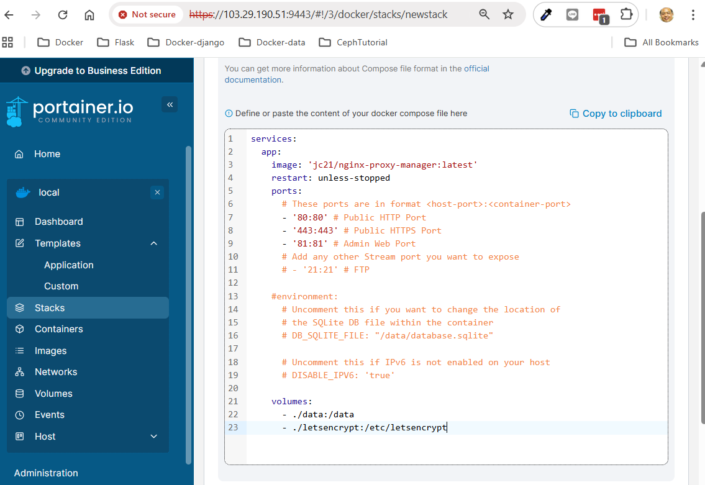

Deploy
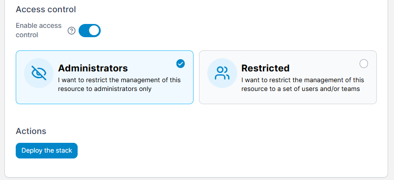
wait
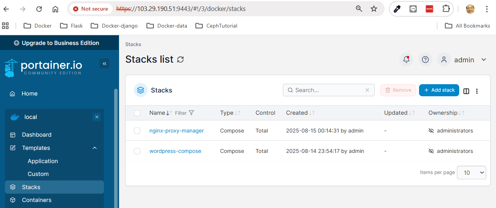

Login:
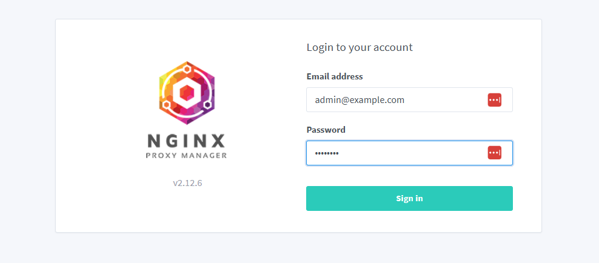

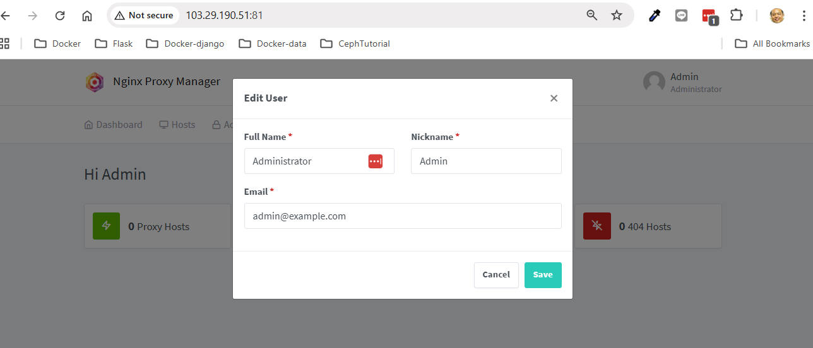

Force change Email:


Set new password:
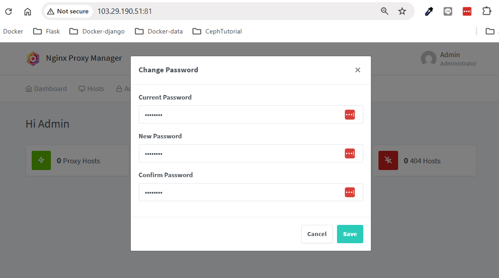  
changeme-> P@ssw0rd

Add domain:
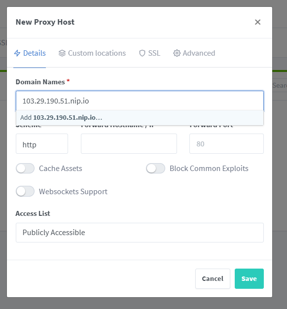
you have to click add popup when you add domain
use  <publicip>.nip.io  like 103.29.190.51.nip.io

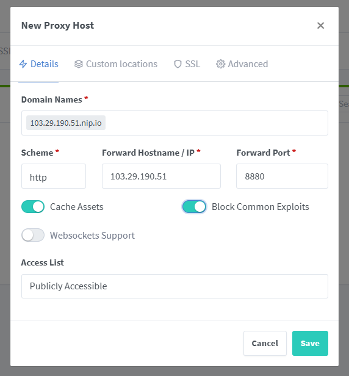

Add SSL from Lets Encrypt Term of Service:
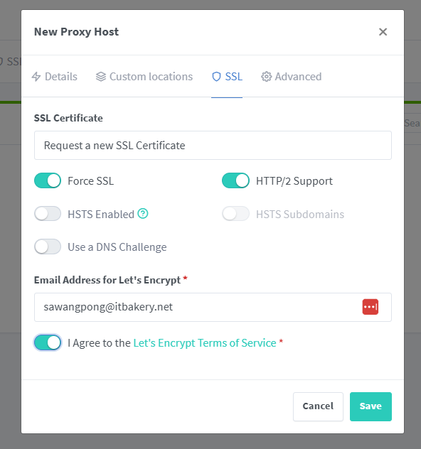

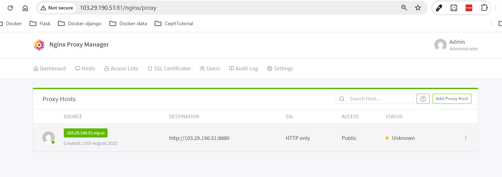

View Blog:
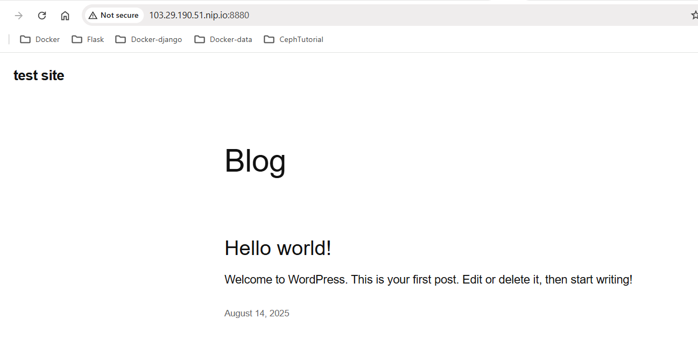

Test:
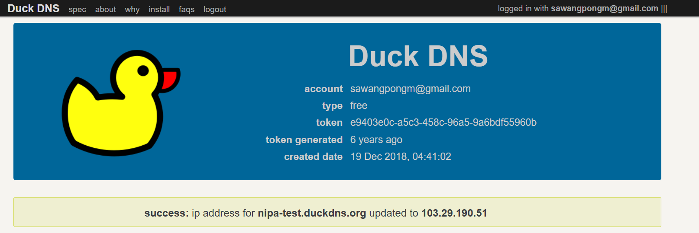

use nipa-test.duckdns.org  on Nginx proxy manager

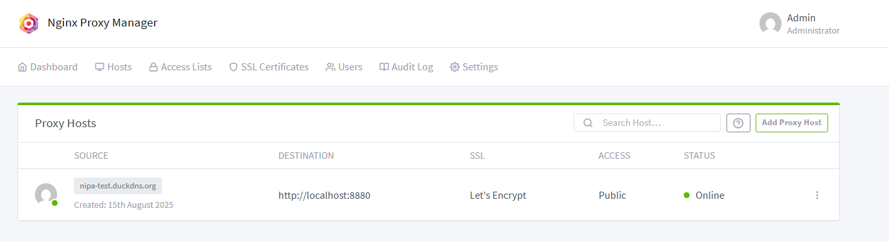

