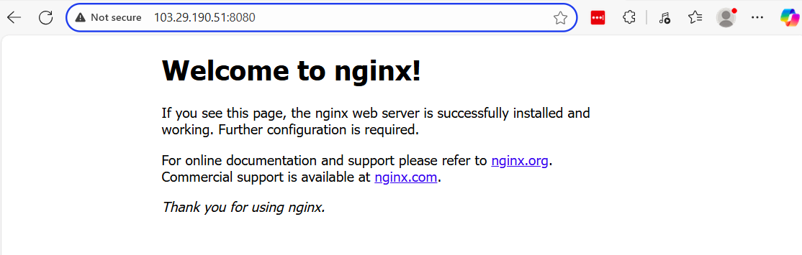

# Docker port Binding Syntax
Docker port binding allows you to map a port on your host machine to a port inside a container. This is essential for accessing services running within the container from the host or external systems.

## Syntax

The basic syntax for port binding is:
```
docker run -p HOST_PORT:CONTAINER_PORT IMAGE_NAME
```

## Example

To bind port 8080 on the host to port 80 inside the container:
```
docker run -d -p 8080:80 nginx
```

In this example:

- 8080 is the host port.
- 80 is the container port.
- nginx is the image name.

Now, accessing http://localhost:8080 on your host will route traffic to port 80 inside the container.


http://103.29.190.51:8080/ change to public ip



### Publishing open Ports to External Access

You can publish all exposed ports of a container to random ephemeral ports on the host using:
```
$ docker ps
CONTAINER ID   IMAGE     COMMAND                  CREATED         STATUS         PORTS                  NAMES
1c5e1ff36937   nginx     "/docker-entrypoint.…"   8 minutes ago   Up 8 minutes   0.0.0.0:8080->80/tcp   ecstatic_gagarin
```


Delete web

```
docker stop <container-id>
docker rm <container-id>
```


### Important Note:

Docker Process Lifecycle vs Regular Linux Processes

#### 1. Starting a Process (Traditional Linux)

```
$ ./myapp
```

- Runs directly on the host OS

- Gets a normal PID (Process ID)

- Uses host's filesystem and network stack

- Parent process is your shell (or systemd if started as service)

#### 2. Starting a Container

```
$ docker run -d --name mycontainer myimage
```
- Creates an isolated environment (container) with:
    - Separate filesystem (from the image)
    - Virtualized network interface
    - Isolated process namespace
- The main process becomes PID 1 inside the container
- Runs as a child of the Docker daemon (dockerd) on the host

#### 3. Process Visibility
Host System View (outside container):
```
$ ps aux | grep myapp
$ kill -9 process-id
```

Container View:
```
$ docker exec mycontainer ps aux
$ docker stop mycontainer
```

| Context          | Command                          | Shows                          |
|------------------|----------------------------------|--------------------------------|
| **Inside Container** | `docker exec <id> ps aux`     | Only that container's processes |
| **Host View**    | `docker top <id>`               | Container's main processes      |
| **All Containers** | `docker ps -q \| xargs...`    | Processes across all containers |
| **Host System**  | `ps aux \| grep docker`        | Docker-related host processes   |