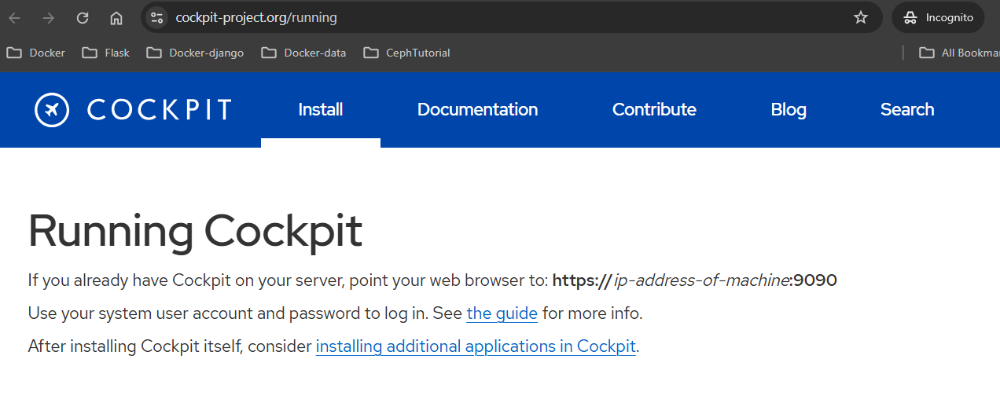
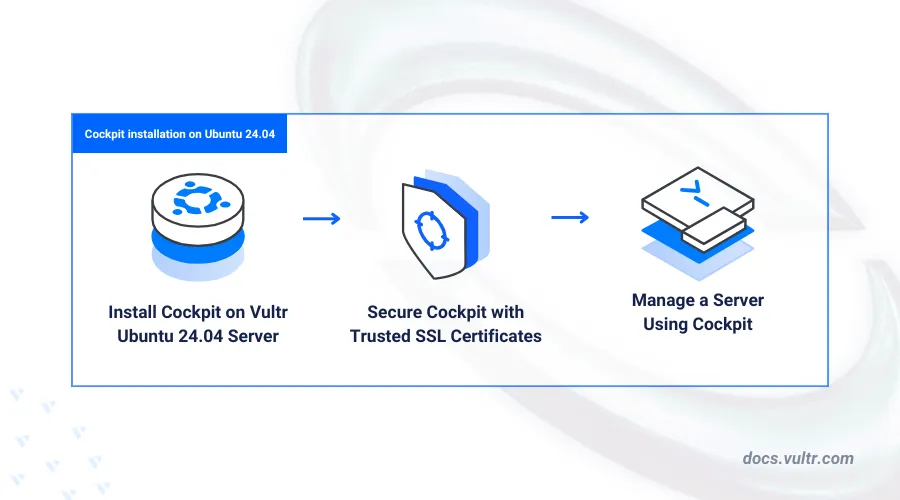
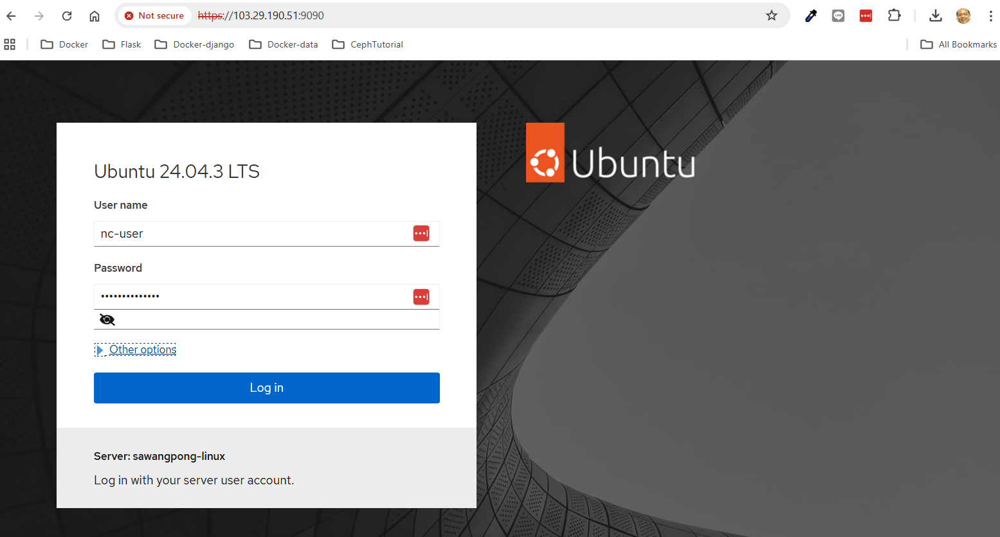
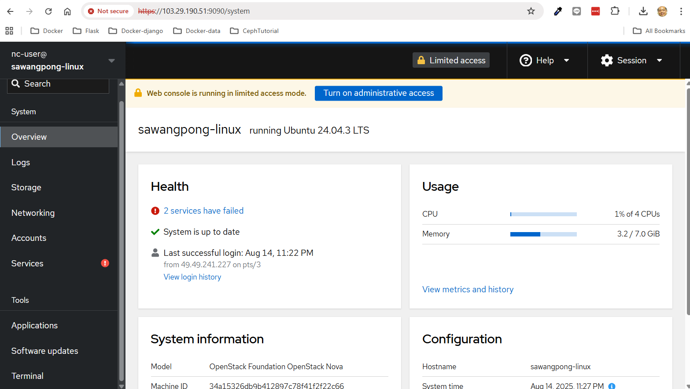
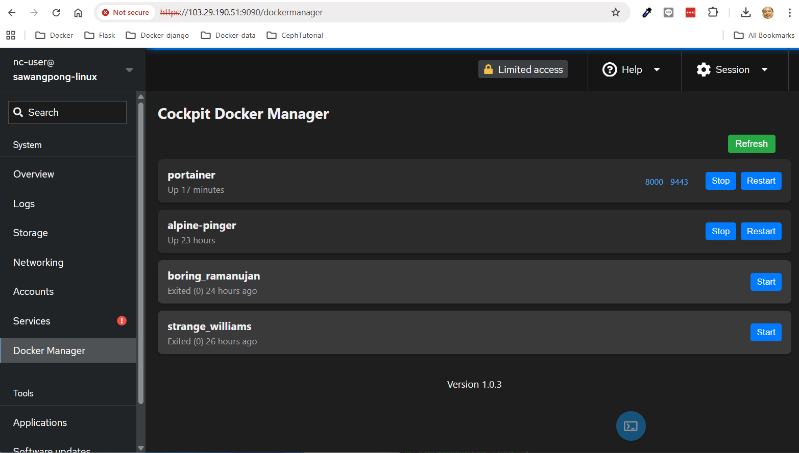

# How to install Cockpit on Ubuntu 24.04

Cockpit is a web-based server management control panel used to perform system administration tasks such as service monitoring, applications, networking, storage, logs, and user account management. Cockpit includes a user-friendly interface that's highly extensible with multiple extensions to perform system administration tasks on a server.

This article explains how to install Cockpit on Ubuntu 24.04 to perform system administration and monitoring tasks using the web-based control panel on a server



```
sudo apt install cockpit -y
sudo systemctl enable cockpit.socket
sudo systemctl start cockpit
sudo systemctl status cockpit
```



Login:


cockpit overview:



Add docker manager to cockpit:

```
curl -L -o dockermanager.deb https://github.com/chrisjbawden/cockpit-dockermanager/releases/download/latest/dockermanager.deb && sudo dpkg -i dockermanager.deb

```

Refresh web, Docker manager menu will list on left menu



