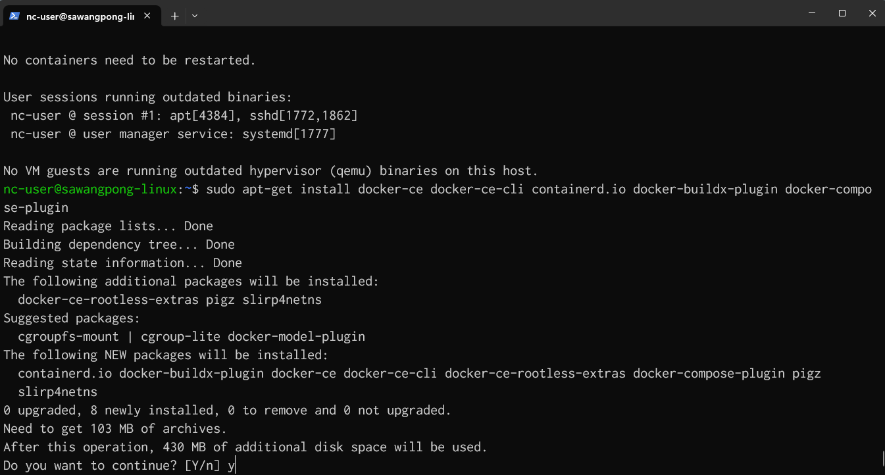
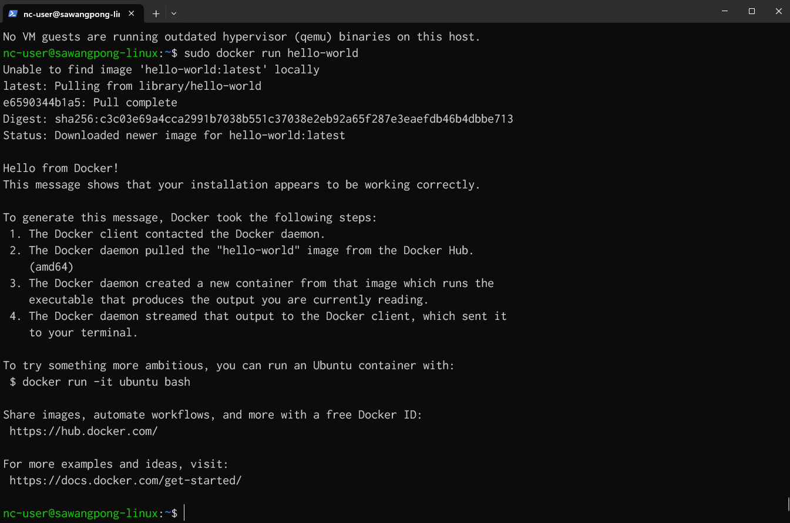
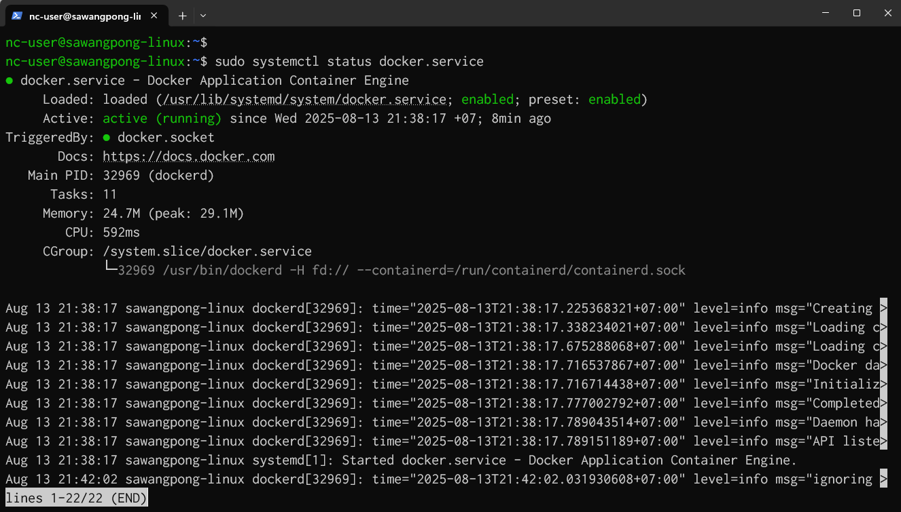
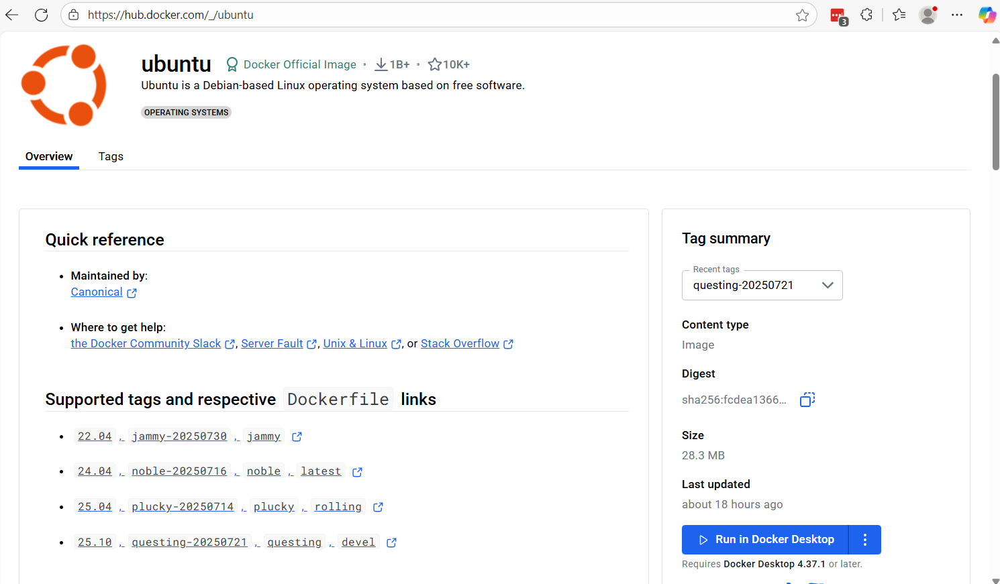
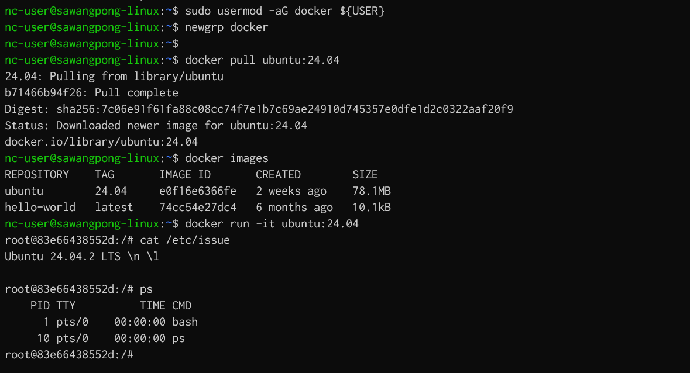
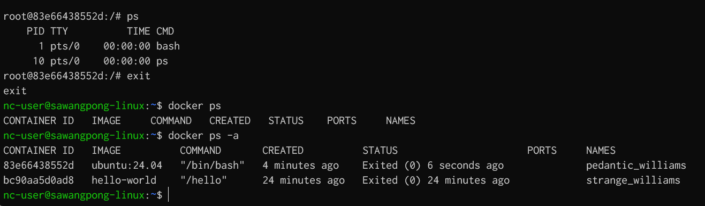
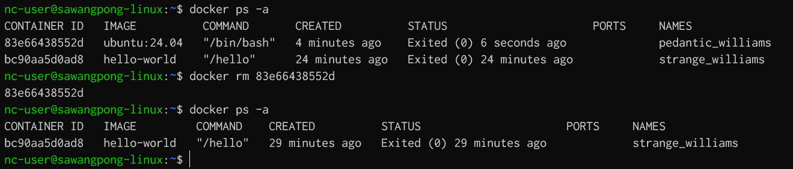

# Install Docker Engine

## 1 Install by Manual Repository

### step 1 Repository
```
## Add Docker's official GPG key:
sudo apt-get update
sudo apt-get install ca-certificates curl

sudo install -m 0755 -d /etc/apt/keyrings

curl -fsSL https://download.docker.com/linux/ubuntu/gpg | sudo gpg --dearmor -o /etc/apt/keyrings/docker.gpg

sudo chmod a+r /etc/apt/keyrings/docker.asc

## Add the repository to Apt sources:

echo \
  "deb [arch=$(dpkg --print-architecture) signed-by=/etc/apt/keyrings/docker.asc] https://download.docker.com/linux/ubuntu \
  $(. /etc/os-release && echo "${UBUNTU_CODENAME:-$VERSION_CODENAME}") stable" | \
  sudo tee /etc/apt/sources.list.d/docker.list > /dev/null

## update package from repository

sudo apt-get update

```

### step 2 Install latest version
```
sudo apt-get install docker-ce docker-ce-cli containerd.io docker-buildx-plugin docker-compose-plugin
```


### step 3 Verify Docker
```
sudo docker run hello-world
```




```
sudo systemctl enable docker.service
sudo systemctl enable containerd.service

sudo systemctl status docker.service
sudo systemctl status containerd.service
```




## After install then Add Current User to Docker Group:
Enable non-root user 
```
# Add your user to the docker group (to run without sudo)
sudo usermod -aG docker ${USER}

# Activate the changes to groups
newgrp docker


```

## Workshop
[https://hub.docker.com/_/ubuntu](https://hub.docker.com/_/ubuntu)



- 1 Pull image from repository
```
sudo lsof -U | grep docker

docker pull ubuntu:24.04
docker images
```
- 2 Run Container bash
```
docker run -it ubuntu:24.04
cat /etc/issue
ps
```



- exit from container and use `docker ps -a` list all container (start and stop)



- Remove stop container
```
$ docker rm <Container ID>
```


---
## Summary:

## Option1: Use script to install script from `https://get.docker.com`
```bash
curl -fsSL https://get.docker.com -o get-docker.sh
sudo sh get-docker.sh
```

## Option2: latest version of Docker on Linux from the test channel
```bash
curl -fsSL https://test.docker.com -o test-docker.sh
sudo sh test-docker.sh
```

## Docker Command
Docker Commands
Now that Docker’s ready, here are some handy commands to play around with:

- List Docker images: `docker images` (shows what images you’ve got)
- List running containers: `docker ps` (shows containers that are active)
- List all containers: `docker ps -a` (shows all containers, even stopped ones)
- Stop a running container: `docker stop` CONTAINER_ID (pauses a container)
- Remove a container: `docker rm CONTAINER_ID` (deletes a container)
- Remove an image: `docker rmi IMAGE_ID` (deletes an image)

You can find the CONTAINER_ID or IMAGE_ID from the docker ps or docker images commands. It’s like organizing your toolbox!