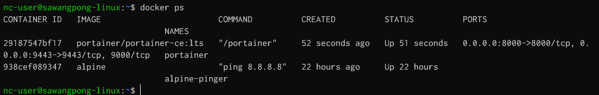

# Install Portainer CE with Docker on Ubuntu
# Docker UI Web Interface 
Portainer consists of two elements, the Portainer Server, and the Portainer Agent. Both elements run as lightweight Docker containers on a Docker engine. This document will help you install the Portainer Server container on your Linux environment. To add a new Linux environment to an existing Portainer Server installation  

[https://docs.portainer.io/start/install-ce/server/docker/linux](https://docs.portainer.io/start/install-ce/server/docker/linux)
## Deployment

```bash
docker volume create portainer_data
docker volume ls
```


then
```bash
docker run -d -p 8000:8000 -p 9443:9443 --name portainer --restart=always -v /var/run/docker.sock:/var/run/docker.sock -v portainer_data:/data portainer/portainer-ce:lts

```


Verify
```
docker ps
```


Login
```
https://<public ip>:9443
```


Next:


Create User:


Get start:


Live Connect:


Dashboard:
