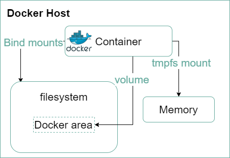
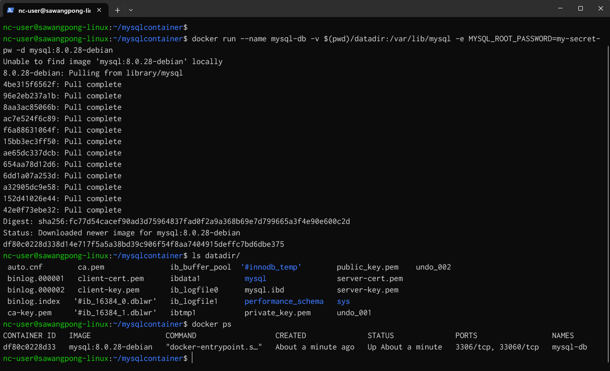
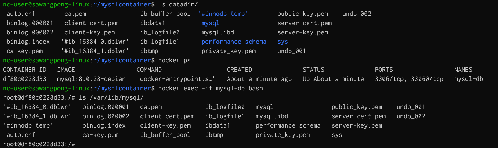
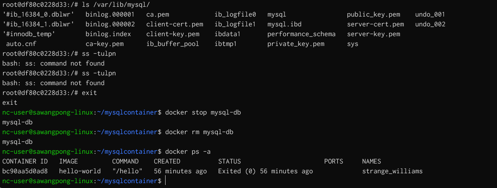
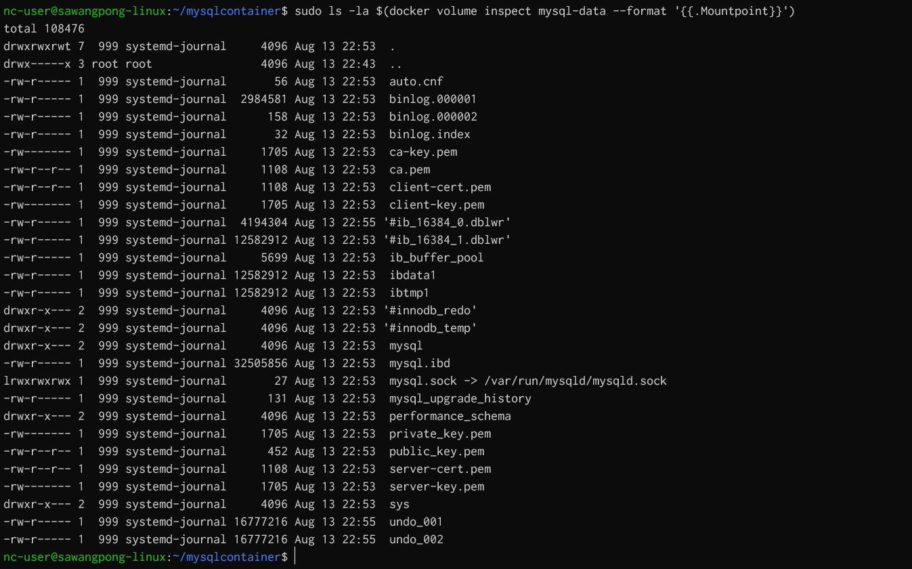

## Docker Run Mount Volume
Mounting volumes in Docker allows you to persist data generated by and used by Docker containers. This is crucial for maintaining data consistency and ensuring that data is not lost when a container is stopped or removed.



### Using the -v or --volume Flag

The -v or --volume flag is used to mount local directories or Docker volumes to a container. This flag allows you to specify the source and target paths, and optionally, mount options.

Example: Mounting a Local Directory

To mount a local directory to a Docker container, you can use the following command:

```
mkdir mysqlcontainer
cd mysqlcontainer

docker run --name mysql-db -v $(pwd)/datadir:/var/lib/mysql -e MYSQL_ROOT_PASSWORD=my-secret-pw -d mysql:8.0.28-debian
```

In this example:

- `$(pwd)/datadir` is the local directory.

- `/var/lib/mysql` is the target directory inside the container.

- `-e MYSQL_ROOT_PASSWORD=my-secret-pw` sets the MySQL root password.

- `-d` runs the container in detached mode.

- `mysql:8.0.28-debian` is the Docker image.



- we can Exec shell in container to enter to container (normal practice)
```
docker exec -it mysql-db bash
```


- Delete Container
```
docker stop mysql-db
docker rm mysql-db
docker ps -a
```



### Example: Using Docker Volumes

Docker volumes are managed by Docker and are not dependent on the host's directory structure. They are useful for persisting data that does not need to be accessed or modified directly from the host.

```
docker volume create mysql-data
docker volume ls
sudo ls /var/lib/docker/volumes
```


- Use docker volume in container
``` 
docker run --name mysql-db -v mysql-data:/var/lib/mysql -e MYSQL_ROOT_PASSWORD=my-secret-pw -d mysql:latest
```


- ls data in volume
```
sudo ls -la $(docker volume inspect mysql-data --format '{{.Mountpoint}}')
```



- stop docker and remove volume
```
docker stop mysql-db
docker volume ls
docker volume rm mysql-data
docker volume ls
```

