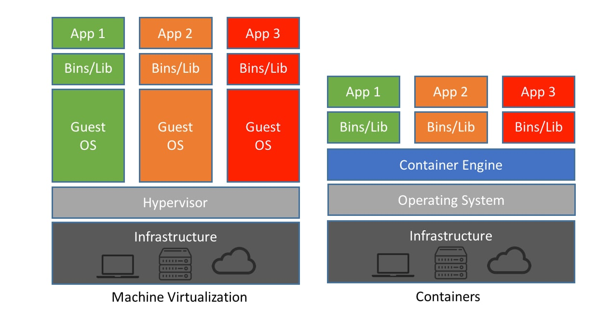

## Nipa Training SysAdmin Day2

Compare VM and Container

The Container as a Complete Runtime Package
Containers bundle applications with all their dependencies - including language runtimes like Node.js, Go, or .NET Core - into self-contained, portable units. This represents a fundamental shift from traditional deployment models.

Key benefits:
- No "it works on my machine" issues
- prevent conflict Node.js runtime
- Isolated dependency tree

# Structure KVM deployment model

# Workshop KVM

[1 KVM Libvirt Virtualization](./libvirt/install-libvirt-qemu.md)
Use Enterprise KVM on Linux Server

[2 Use Vagrant to Manage VM](./libvirt/install-vagrant.md)  
Auto Deploy WebServer on Nested VM , fully isolation

[3 Web-Db Deploy with Vagrant](./libvirt/install-web-database.md)

# Workshop Container
[1 Docker Architecture](./container/architecture.md)
Understack Docker Architencture

[2 Install Docker on Ubuntu 24.04](./container/install-docker.md)  
install docker container on Ubuntu 24.04

[3 Docker Volume](./container/volume.md)  
Understand Docker Volume

[4 Docker file and application](./container/dockerfile-explain.md)  
Pack application in container by Dockerfile

[5 Docker Port forword](./container/docker-port.md)  
Access to container process by forword port

[6 Install Portainer Docker Web UI](./container/install-portainer.md)

[7 Install cockpit ubuntu 24.04](./container/install-cockpit.md)

[8 Deploy Wordpress with Docker](./container/deploy-wordpress.md)

[9 Test Nginx Reverse proxy manager](./container/deploy-nginx-proxy-manager.md)