## Deploying an Application with Portainer Stacks

Portainer provides several options for deploying new applications. One of these is stacks, a thin wrapper around Docker Compose functionality. A stack is a collection of one or more containers that collectively provide a complete application. You could have a stack consisting of an API, a database, and a frontend web UI:

```
services:
  db:
    image: mysql:8.0
    environment:
     - MYSQL_ROOT_PASSWORD=${MYSQL_ROOT_PASSWORD}
     - MYSQL_DATABASE=${MYSQL_DATABASE}
     - MYSQL_USER=${MYSQL_USER}
     - MYSQL_PASSWORD=${MYSQL_PASSWORD}
    volumes:
       - db:/var/lib/mysql
  wordpress:
    image: wordpress:latest
    ports:
      - 8880:80
    environment:
      - WORDPRESS_DB_HOST=db
      - WORDPRESS_DB_USER=${MYSQL_USER}
      - WORDPRESS_DB_PASSWORD=${MYSQL_PASSWORD}
      - WORDPRESS_DB_NAME=${MYSQL_DATABASE}
volumes:
  db:
```
take code to validate at  https://www.yamllint.com/ 

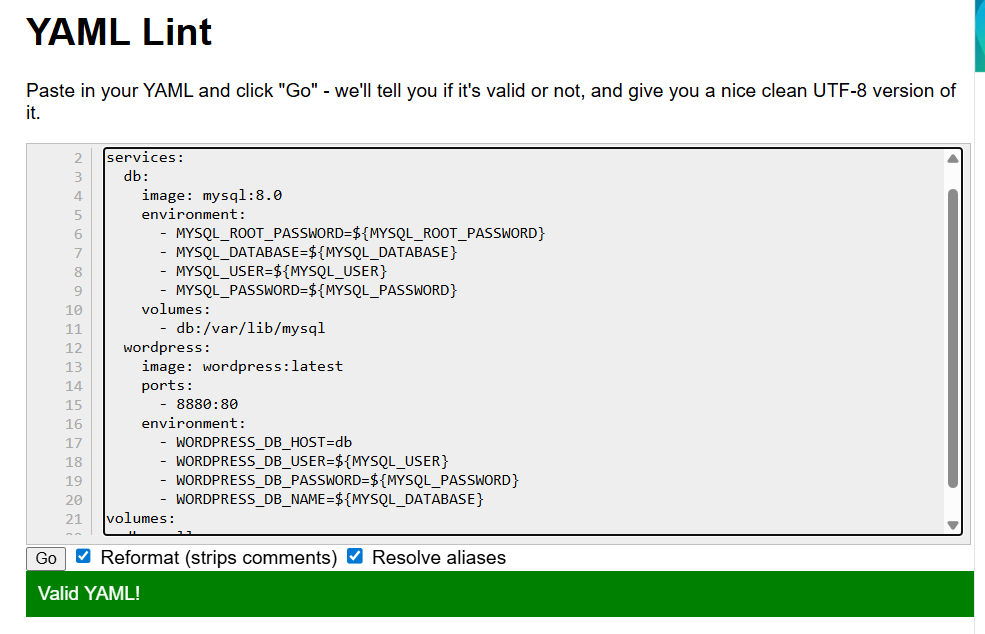

Add stack:
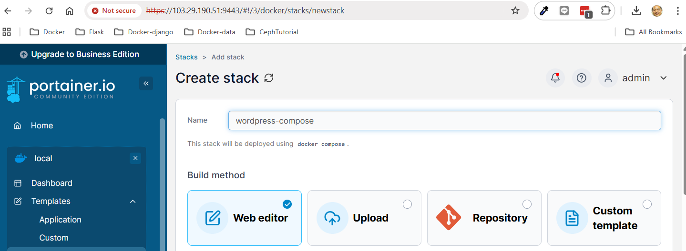

click menu stacks on left side, then click add stack

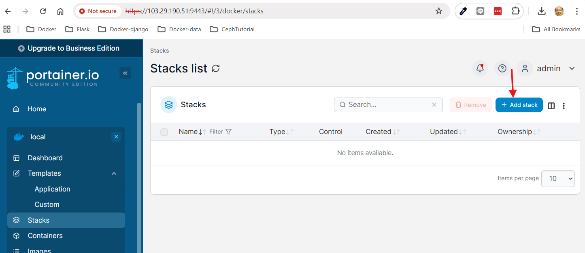

Add wordpress yml:
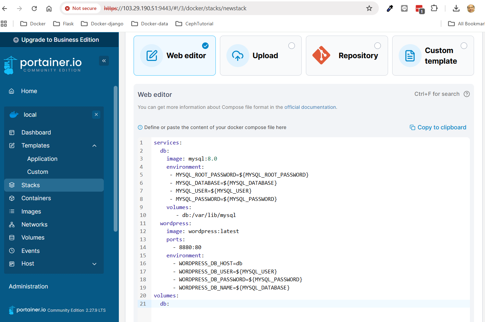

Add variable:  scroll next section
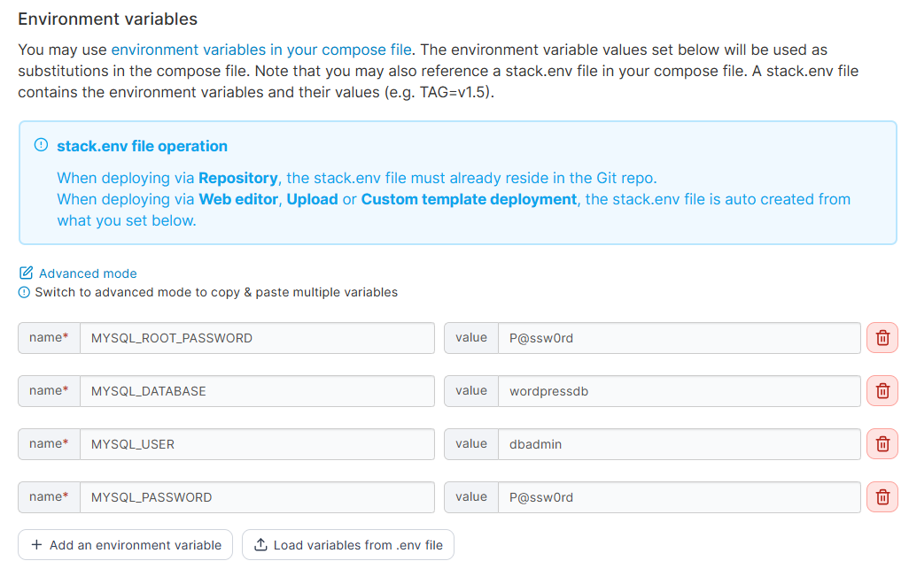

Final Deploy stack
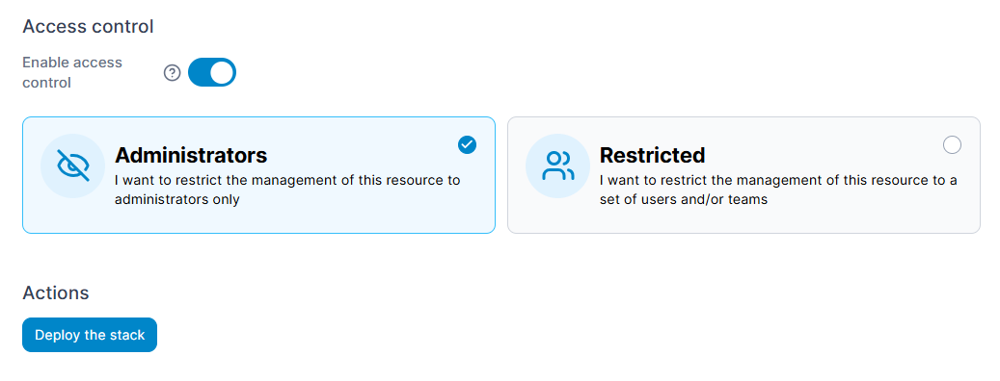

Click menu Stack agian:
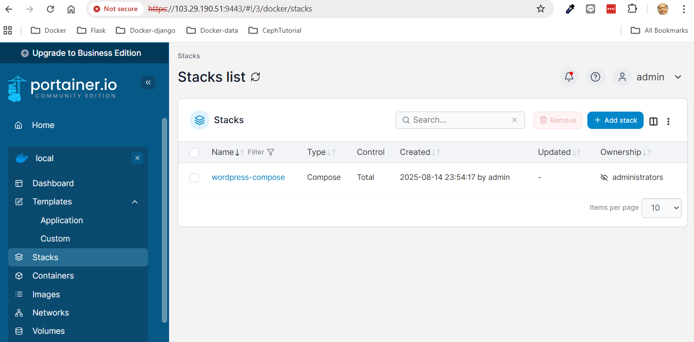

Click name of stack just deploy(wordpress-compose):
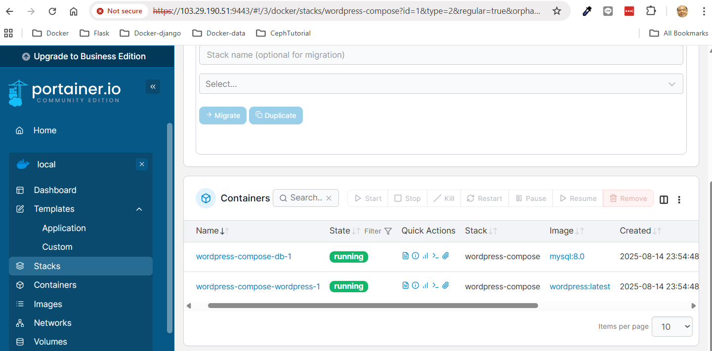

## Open Browser  http://<public-ip>:8880
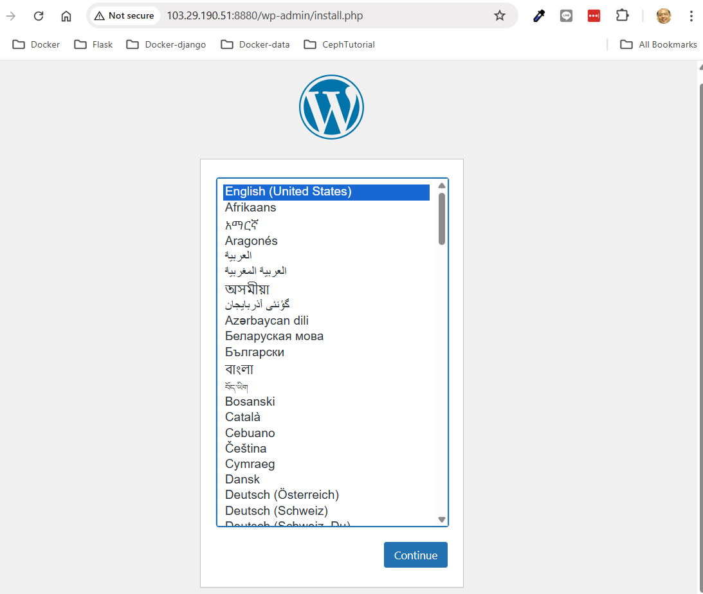

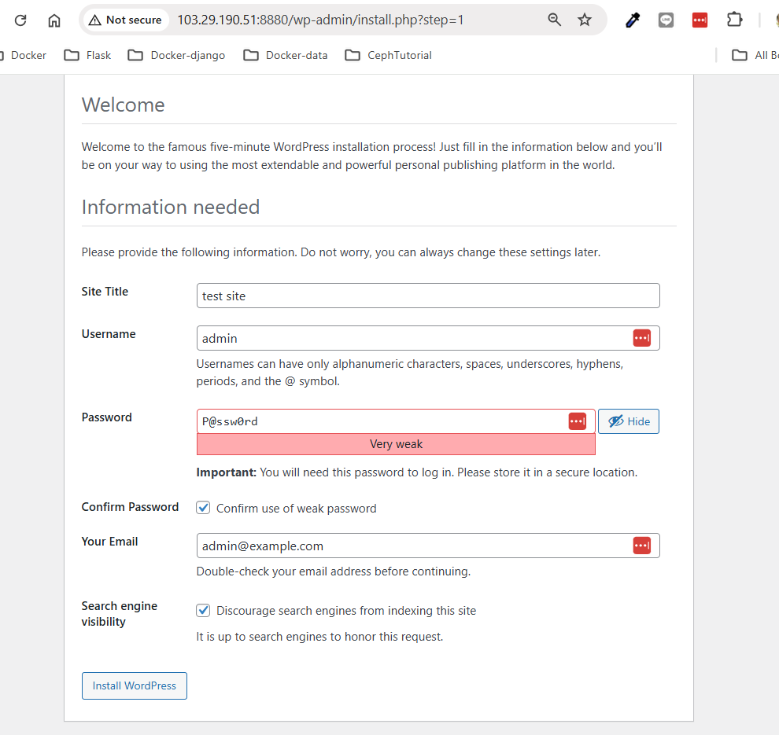

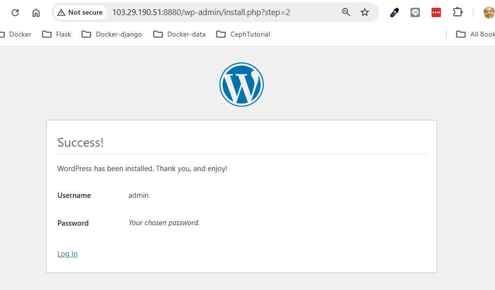

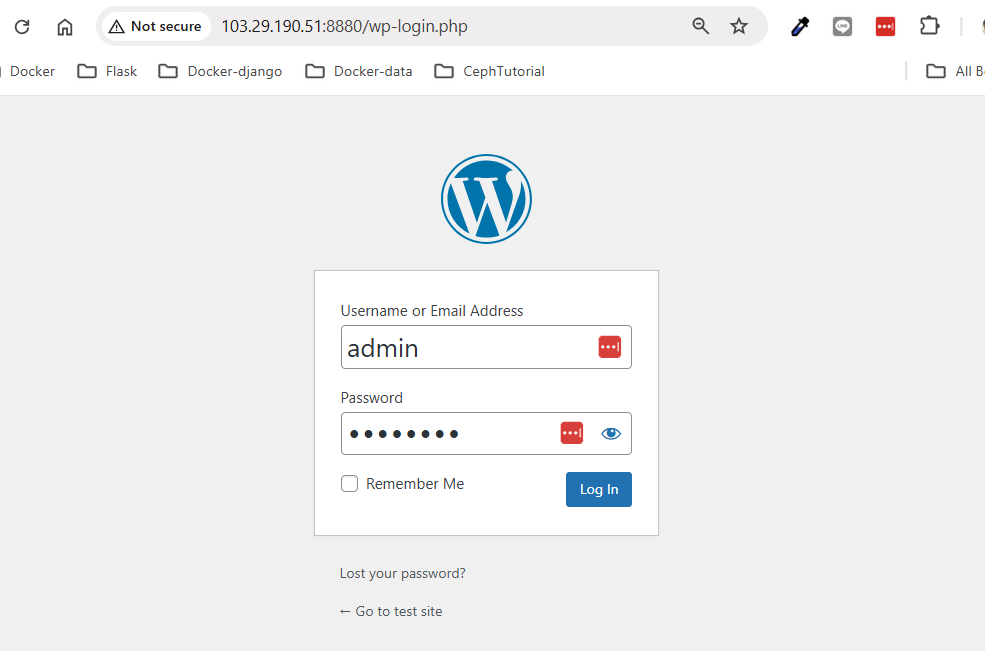

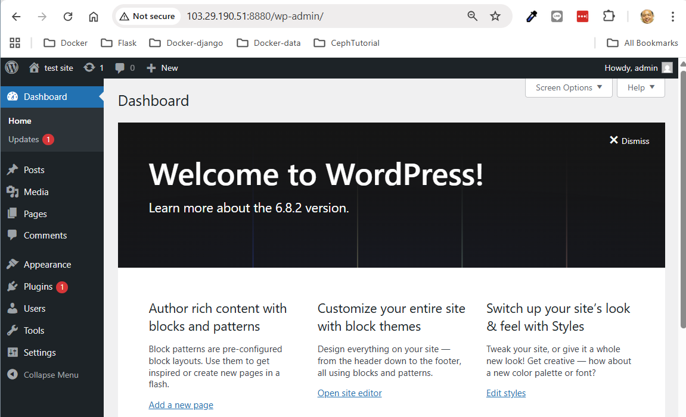