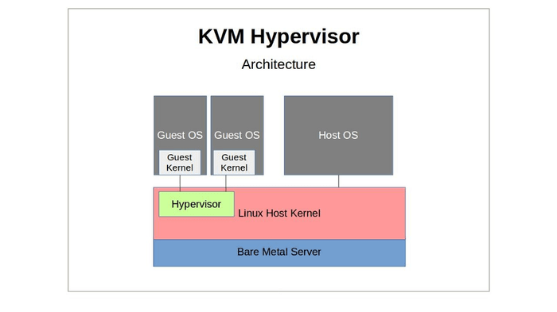
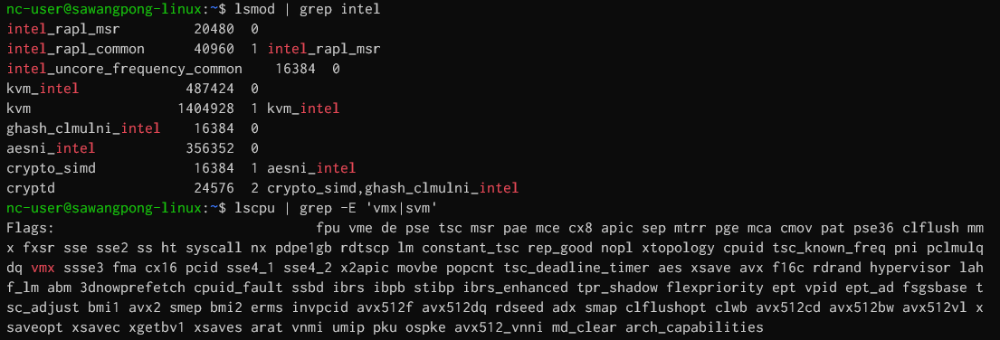
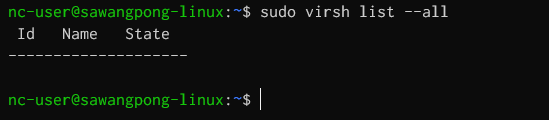
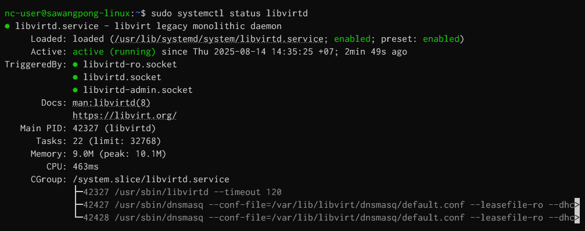
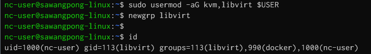
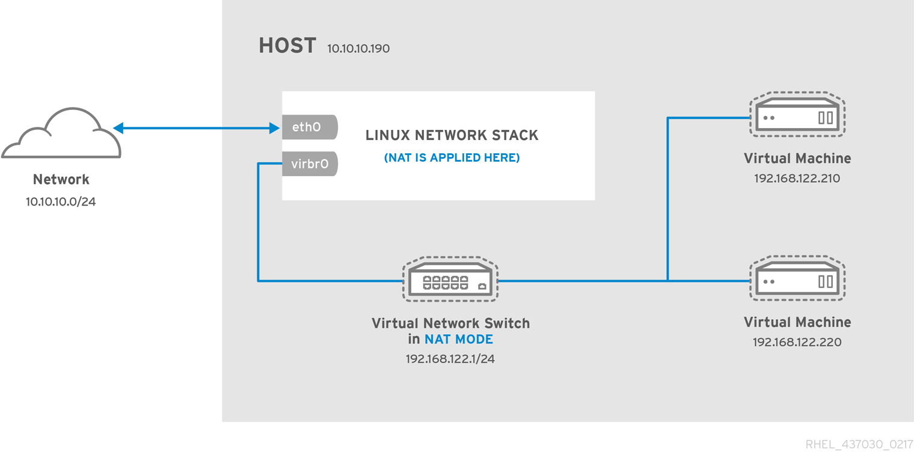
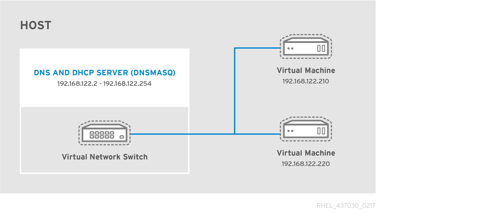
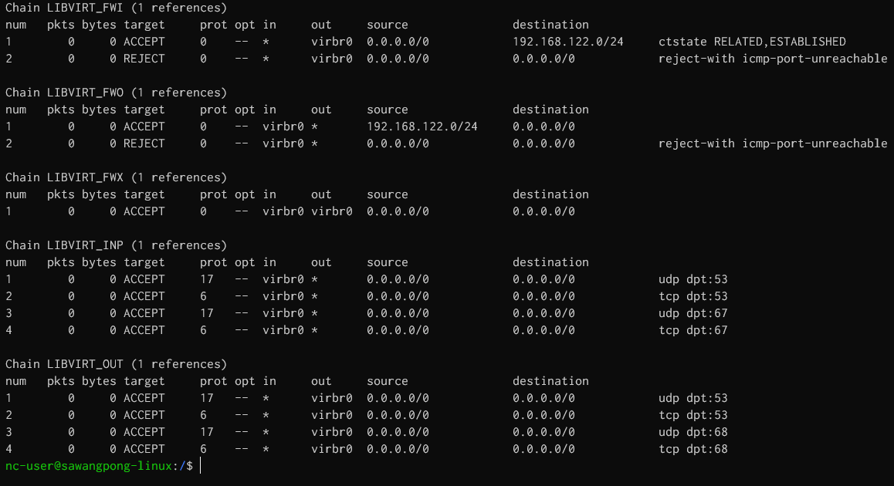
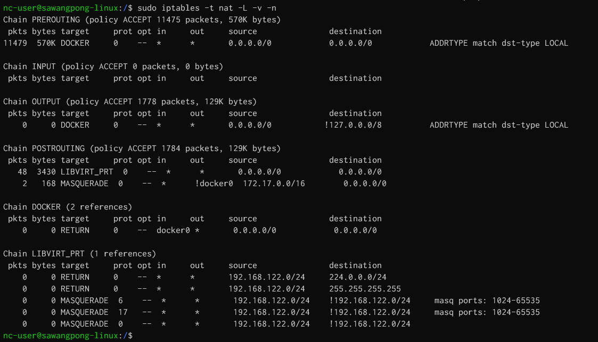
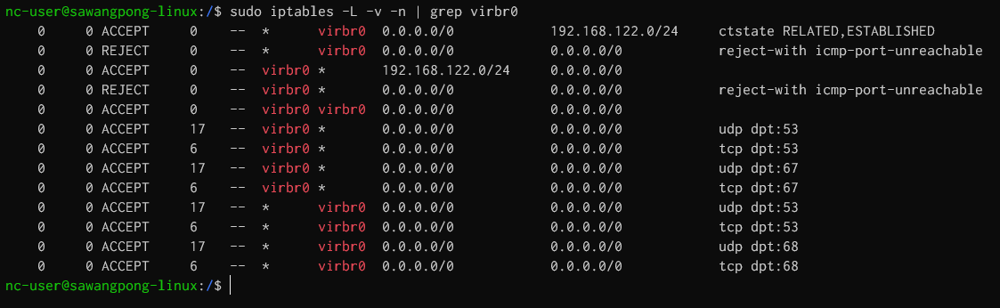

#  Install Libvirt Qemu on UBuntu 24.04



### What is KVM?  
The Kernel-based Virtual Machine (KVM) serves as a virtualization solution that is embedded within the Linux kernel to transform Linux into a Type 1 hypervisor directly interacting with hardware systems without the need for an operating system layer like Type 2 hypervisors require. Integrating processor extensions like Intel VT x or AMD V into its operation allows KVM to virtualize hardware components and create environments for hosting operating systems and their associated applications and services. It is beneficial for developers and system administrators looking to efficiently manage and operate multiple operating systems within a single computing environment.

Why is KVM important?
Kernel-based Virtual Machine (KVM) can turn any Linux machine into a bare-metal hypervisor. This allows developers to scale computing infrastructure for different operating systems without investing in new hardware. KVM frees server administrators from manually provisioning virtualization infrastructure and allows large numbers of virtual machines to be deployed easily in cloud environments. 

Businesses use KVM because of the following advantages.

High performance
KVM is engineered to manage high-demanding applications seamlessly. All guest operating systems inherit the high performance of the host operating system—Linux. The KVM hypervisor also allows virtualization to be performed as close as possible to the server hardware, which further reduces process latency. 

### Security   
Virtual machines running on KVM enjoy security features native to the Linux operating system, including Security-Enhanced Linux (SELinux). This ensures that all virtual environments strictly adhere to their respective security boundaries to strengthen data privacy and governance. 

### Stability  
KVM has been widely used in business applications for more than a decade. It enjoys excellent support from a thriving open-source community. The source code that powers KVM is mature and provides a stable foundation for enterprise applications. 

### Cost efficiency  
KVM is free and open source, which means businesses do not have to pay additional licensing fees to host virtual machines. 

### Flexibility  
KVM provides businesses many options during installations, as it works with various hardware setups. Server administrators can efficiently allocate additional CPU, storage, or memory to a virtual machine with KVM. KVM also supports thin provisioning, which only provides the resources to the virtual machine when needed. 

### How does KVM work?  
Kernel-based Virtual Machine (KVM) requires a Linux kernel installation on a computer powered by a CPU that supports virtualization extensions. Specifically, KVM supports all x86 CPUs, a family of computer chips capable of processing the Intel x86 instruction language. 

### Linux kernel  
Linux kernel is the core of the open-source operating system. A kernel is a low-level program that interacts with computer hardware. It also ensures that software applications running on the operating system receive the required computing resources. Linux distributions, such as Red Hat Enterprise Linux, Fedora, and Ubuntu, pack the Linux kernel and additional programs into a user-friendly commercial operating system.

### How to enable KVM  
Once you have installed the Linux kernel, you need to install the following additional software components on the Linux machine:

- A host kernel module
- A processor-specific module
- An emulator
- A range of other Linux packages for expanding KVM’s capabilities and performance     

Once loaded, the server administrator creates a virtual machine via the command line tool or graphical user interface. KVM then launches the virtual machine as an individual Linux process. The hypervisor allocates every virtual machine with virtual memory, storage, network, CPU, and resources.

### Check intel kernel module  in VM
```
nc-user@sawangpong-linux:~$ lsmod | grep intel
intel_rapl_msr         20480  0
intel_rapl_common      40960  1 intel_rapl_msr
intel_uncore_frequency_common    16384  0
kvm_intel             487424  0
kvm                  1404928  1 kvm_intel
ghash_clmulni_intel    16384  0
aesni_intel           356352  0
crypto_simd            16384  1 aesni_intel
cryptd                 24576  2 crypto_simd,ghash_clmulni_intel
```
### Check virtualization support
```
nc-user@sawangpong-linux:~$ lscpu | grep -E 'vmx|svm'
```
If the output includes “vmx” or “svm”, your CPU supports virtualization. If not, KVM cannot run on your system.



### Install kvm and packages

```
sudo apt install -y qemu-kvm libvirt-daemon-system libvirt-clients bridge-utils
```

- `qemu-kvm:` Installation of the KVM module and tools.
- `libvirt-daemon-system` and `libvirt-clients:` Handle virtualization management services.
- `bridge-utils:` Helps configure networking for VMs.

### List VM

```
$ sudo virsh list --all
```


### Check status kvm
```
sudo systemctl status libvirtd
```


press Ctrl-c to exit

### Add user to KVM and Libvirt Group
```
sudo usermod -aG kvm,libvirt $USER
newgrp libvirt
id
```



## Configure network for virtual machine

Networking setup allows VMs to connect to the network or the internet. By default, KVM provides Network Address Translation (NAT), which is suitable for most basic setups.

```
ip a
...
19: virbr0: <NO-CARRIER,BROADCAST,MULTICAST,UP> mtu 1500 qdisc noqueue state DOWN group default qlen 1000
    link/ether 52:54:00:4c:9c:a0 brd ff:ff:ff:ff:ff:ff
    inet 192.168.122.1/24 brd 192.168.122.255 scope global virbr0
       valid_lft forever preferred_lft forever
```
- virbr0 have status `Down` because there is no VM connect virbr0

```
ip link show virbr0

19: virbr0: <NO-CARRIER,BROADCAST,MULTICAST,UP> mtu 1500 qdisc noqueue state DOWN mode DEFAULT group default qlen 1000
    link/ether 52:54:00:4c:9c:a0 brd ff:ff:ff:ff:ff:ff

```
- 192.168.122.1 → Default gateway for VMs using NAT.


## Check DHCP Leases (for VMs)
```
sudo cat /var/lib/libvirt/dnsmasq/virbr0.status
```

## virsh command
```
sudo virsh net-list --all
 Name      State    Autostart   Persistent
--------------------------------------------
 default   active   yes         yes
```
if network default is inactive, start it

```
sudo virsh net-start default
sudo virsh net-autostart default
```
Note:  
By default, virtual network switches operate in NAT mode. They use IP masquerading rather than SNAT (Source-NAT) or DNAT (Destination-NAT). IP masquerading enables connected guests to use the host physical machine IP address for communication to any external network. By default, computers that are placed externally to the host physical machine cannot communicate to the guests inside when the virtual network switch is operating in NAT mode, as shown in the following diagram:



## DNS and DHCP 

IP information can be assigned to guests via DHCP. A pool of addresses can be assigned to a virtual network switch for this purpose. Libvirt uses the dnsmasq program for this. An instance of dnsmasq is automatically configured and started by libvirt for each virtual network switch that needs it.



## Linux kernel network stack

The Linux Kernel Network Stack is a critical part of the operating system that handles all network communications, from low-level packet processing to high-level protocol implementations (like TCP/IP). It is designed for performance, scalability, and flexibility, supporting everything from embedded devices to high-speed data centers.

### Overview of the Linux Network Stack
The Linux network stack follows a layered architecture, similar to the OSI model but optimized for performance. Here’s a simplified breakdown:

| **Layer**          | **Linux Kernel Components**                     | **Key Functions** |
|--------------------|-----------------------------------------------|------------------|
| **Hardware Layer** | Network Interface Card (NIC) & Drivers (`drivers/net/`) | Packet transmission/reception, DMA, interrupts |
| **Link Layer**     | **MAC, VLAN, Bridge, Bonding (`net/8021q/`, `net/bridge/`)** | Ethernet framing, ARP, MAC learning |
| **Network Layer**  | **IPv4/IPv6 (`net/ipv4/`, `net/ipv6/`), Routing (`net/ipv4/route.c`)** | IP routing, NAT, ICMP, firewalling (Netfilter) |
| **Transport Layer**| **TCP (`net/ipv4/tcp*.c`), UDP (`net/ipv4/udp.c`), SCTP** | Reliable/unreliable data transfer, congestion control |
| **Socket Layer**   | **Sockets API (`net/socket.c`), `AF_INET`, `AF_PACKET`** | User-space interface (`send()`, `recv()`, etc.) |


### User iptables command to view firewall from linux kernel stack

```
sudo iptables -L -v -n --line-numbers
```



```
sudo iptables -t nat -L -v -n
```



```
sudo iptables -L -v -n | grep virbr0
```


## Summary linux command for network stack

| **Command**                              | **Purpose**                          |
|------------------------------------------|--------------------------------------|
| `sudo iptables -L -v -n`                 | List all `iptables` rules            |
| `ip addr show virbr0`                    | Check `virbr0` IP and status         |
| `sudo virsh net-list --all`              | List libvirt networks                |
| `sudo cat /var/lib/libvirt/dnsmasq/virbr0.status` | Check DHCP leases for VMs    |