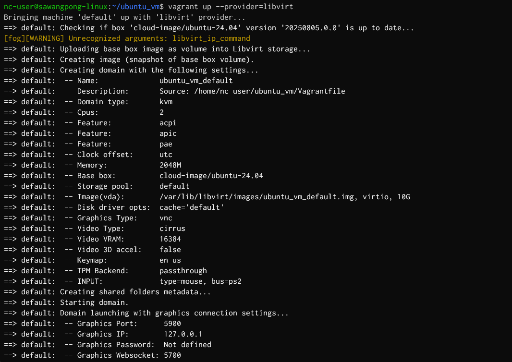
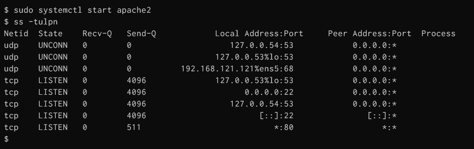
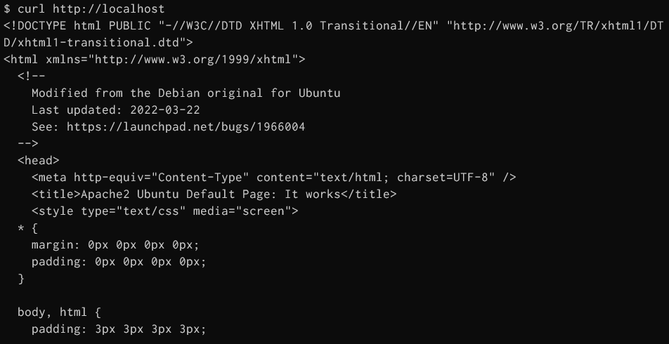
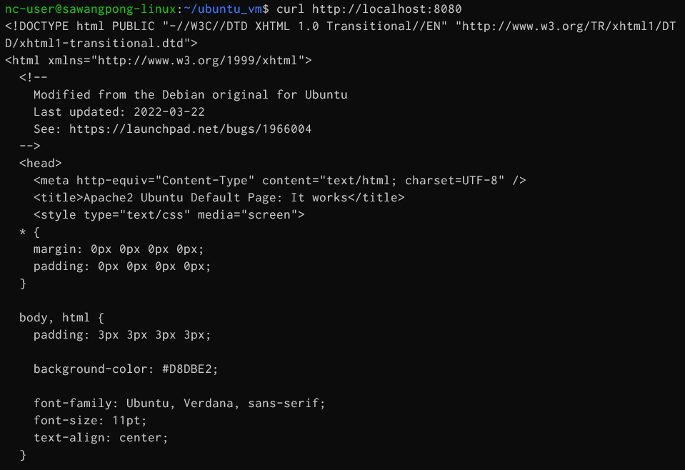
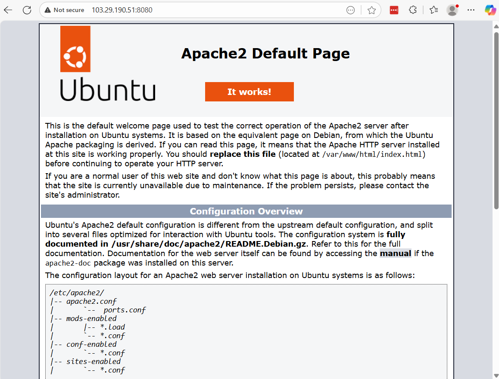

# Install Vagrant command

[https://developer.hashicorp.com/vagrant/install](https://developer.hashicorp.com/vagrant/install)


Install (from vagrant official website)

```bash
## add key
wget -O - https://apt.releases.hashicorp.com/gpg | sudo gpg --dearmor -o /usr/share/keyrings/hashicorp-archive-keyring.gpg

## Add repo
echo "deb [arch=$(dpkg --print-architecture) signed-by=/usr/share/keyrings/hashicorp-archive-keyring.gpg] https://apt.releases.hashicorp.com $(grep -oP '(?<=UBUNTU_CODENAME=).*' /etc/os-release || lsb_release -cs) main" | sudo tee /etc/apt/sources.list.d/hashicorp.list

## update
sudo apt update && sudo apt install vagrant -y

## Install vagrant plugin for libvirt
sudo apt install build-essential -y
sudo apt install libvirt-dev -y
vagrant plugin install vagrant-libvirt
vagrant plugin list
```


### Managing KVM virtual virtual machine by vagrant


Add vagrant box from [https://portal.cloud.hashicorp.com/vagrant/discover?query=ubuntu24](https://portal.cloud.hashicorp.com/vagrant/discover?query=ubuntu24)


### Downloa vagrant box (select type libvirt provider)
```
vagrant box add  jtarpley/ubuntu2404_base --provider=libvirt

vagrant box list
```


```
vagrant box add cloud-image/ubuntu-24.04 --provider=libvirt
```


### Next Create Vagrantfile


vagrant process will read instruction from Vagrantfile

```bash
cd ~
mkdir ubuntu_vm
cd ubuntu_vm
vagrant init cloud-image/ubuntu-24.04

vim Vagrantfile
```


This creates a basic Vagrantfile. You may need to modify it to specify the libvirt provider explicitly if you have multiple providers installed or for specific configurations:

```ruby
Vagrant.configure("2") do |config|
    config.vm.box = "cloud-image/ubuntu-24.04"
    config.vm.provider :libvirt do |libvirt|
        libvirt.memory = "2048"
        libvirt.cpus = 2
        libvirt.driver = "kvm"
        libvirt.uri = 'qemu:///system'
    end
end
```
Part of Vagrantfile:


# Create VM from command   
command `vagrant up`
```
vagrant up --provider=libvirt
```


### Connect to vm
Basic operation command
```
vagrant status
vagrant ssh -c "ip a"
vagrant ssh 
```


```
vagrant ssh
```


### command
network inside vm

```
ip a
ip r
ip --help
ip neighbour
exit
```


### Stop vm
```
vagrant halt
```

### Destroy VM
```
vagrant destroy
```


# Next Step
- Add file systemc sync from host to VM (/vagrant)
- Add more Network


```bash
sudo apt install rsync

Reading package lists... Done
Building dependency tree... Done
Reading state information... Done
rsync is already the newest version (3.2.7-1ubuntu1.2).
0 upgraded, 0 newly installed, 0 to remove and 0 not upgraded.
```
[https://developer.hashicorp.com/vagrant/docs/cli/rsync-auto](https://developer.hashicorp.com/vagrant/docs/cli/rsync-auto)


### Step to enable rsync
- Edit file Vagrantfile
```
config.vm.synced_folder ".", "/vagrant", type: "rsync", rsync__exclude: ".git/"
```


### Step to enable network

```
config.vm.network "private_network", ip: "192.168.100.10"
```


### Step enable shell script

```
config.vm.provision "shell", inline: <<-SHELL
       apt-get update
       apt-get install -y apache2
SHELL
```


Final Vagrantfile:
```ruby
# -*- mode: ruby -*-
# vi: set ft=ruby :

Vagrant.configure("2") do |config|
  config.vm.box = "cloud-image/ubuntu-24.04"
  config.vm.network "private_network", ip: "192.168.100.10"
  config.vm.network "forwarded_port", guest: 80, host: 8080
  config.vm.synced_folder ".", "/vagrant", type: "rsync", rsync__exclude: ".git/"

  config.vm.provider "libvirt" do |libvirt|
      libvirt.memory = "2048"
      libvirt.cpus = 2
      libvirt.driver = "kvm"
      libvirt.uri = "qemu:///system"
  end

  config.vm.provision "shell", inline: <<-SHELL
     apt-get update
     apt-get install -y apache2
  SHELL
end
```

### Star VM vagrant up again
- Run inside project which contain file Vagrantfile
```
vagrant up --provider=libvirt 
vagrant ssh
```


```
dpkg -l | grep apache2
apache2 -v
```


# Name VM as you want like "webserver"
```ruby
# -*- mode: ruby -*-
# vi: set ft=ruby :

Vagrant.configure("2") do |config|
  config.vm.define "webserver" do |default|
    default.vm.box = "cloud-image/ubuntu-24.04"
    default.vm.network "private_network", ip: "192.168.100.10"
    default.vm.network "forwarded_port", guest: 80, host: 8080
    default.vm.synced_folder ".", "/vagrant", type: "rsync", rsync__exclude: ".git/"

    default.vm.provider "libvirt" do |libvirt|
      libvirt.memory = "2048"
      libvirt.cpus = 2
      libvirt.driver = "kvm"
      libvirt.uri = "qemu:///system"
    end

    default.vm.provision "shell", inline: <<-SHELL
      apt-get update
      apt-get install -y apache2
    SHELL
  end
end
```

## Check vagrant status
```
$ vagrant status
[fog][WARNING] Unrecognized arguments: libvirt_ip_command
Current machine states:

webserver                 running (libvirt)

The Libvirt domain is running. To stop this machine, you can run
`vagrant halt`. To destroy the machine, you can run `vagrant destroy`.
```
- webserver is name of server 

```
vagrant ssh
```

```
sudo systemctl start apache2
ss -tulpn

Netid  State    Recv-Q   Send-Q            Local Address:Port     Peer Address:Port  Process
udp    UNCONN   0        0                    127.0.0.54:53            0.0.0.0:*
udp    UNCONN   0        0                 127.0.0.53%lo:53            0.0.0.0:*
udp    UNCONN   0        0          192.168.121.121%ens5:68            0.0.0.0:*
tcp    LISTEN   0        4096              127.0.0.53%lo:53            0.0.0.0:*
tcp    LISTEN   0        4096                    0.0.0.0:22            0.0.0.0:*
tcp    LISTEN   0        4096                 127.0.0.54:53            0.0.0.0:*
tcp    LISTEN   0        4096                       [::]:22               [::]:*
tcp    LISTEN   0        511                           *:80                  *:*
```





## Test Webpage
```
curl http://localhost
```



- Exit from vm and test from host shell on port 8080 , Because we forward from VM:80 to Host:8080

```
nc-user@sawangpong-linux:~/ubuntu_vm$ curl http://localhost:8080
```



## Test from External Access
