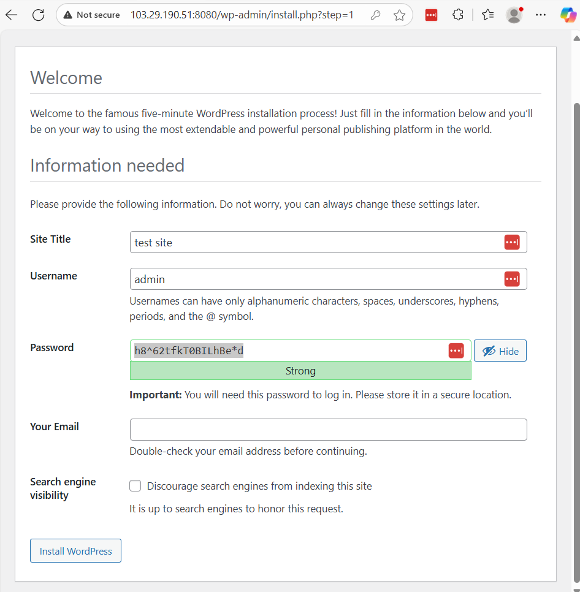
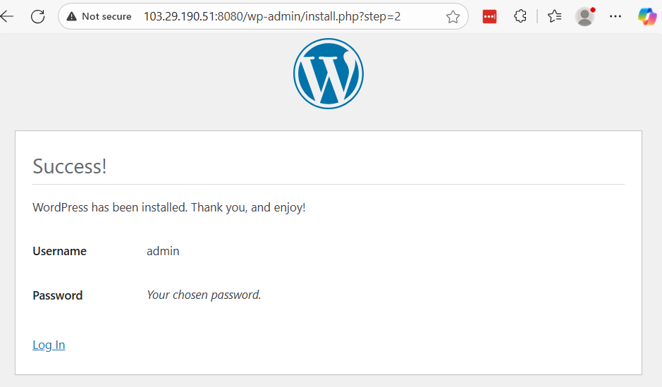

# Deploy WebServer 2 VM with Vagrant

```
mkdir web-db-vm
cd web-db-vm
vim Vagrantfile
```

### Vagrantfle for wordpress

Vagrantfile that deploys a WordPress installation with separate web server (Apache) and database (MySQL) on Ubuntu 24.04:

```ruby
# -*- mode: ruby -*-
# vi: set ft=ruby :

Vagrant.configure("2") do |config|
  # ------------------------
  # Web Server VM
  # ------------------------
  config.vm.define "webserver" do |web|
    web.vm.box = "cloud-image/ubuntu-24.04"
    web.vm.hostname = "webserver"
    web.vm.network "private_network", ip: "192.168.100.10"
    web.vm.network "forwarded_port", guest: 80, host: 8080

    web.vm.provider "libvirt" do |libvirt|
      libvirt.memory = "2048"
      libvirt.cpus = 2
    end

    web.vm.provision "shell", inline: <<-SHELL
      apt-get update
      apt-get install -y apache2 php libapache2-mod-php php-mysql wget tar unzip

      # Enable rewrite
      a2enmod rewrite

      rm -rf /var/www/html/*
      wget https://wordpress.org/latest.tar.gz -O /tmp/wordpress.tar.gz
      tar -xzf /tmp/wordpress.tar.gz -C /tmp
      cp -r /tmp/wordpress/* /var/www/html/
      chown -R www-data:www-data /var/www/html/

      cat > /etc/apache2/sites-available/wordpress.conf <<EOF
<VirtualHost *:80>
    ServerAdmin webmaster@localhost
    ServerName localhost
    DocumentRoot /var/www/html

    <Directory /var/www/html>
        Options FollowSymLinks
        AllowOverride All
        Require all granted
    </Directory>

    ErrorLog \${APACHE_LOG_DIR}/error.log
    CustomLog \${APACHE_LOG_DIR}/access.log combined
</VirtualHost>
EOF

      a2ensite wordpress
      a2dissite 000-default
      systemctl restart apache2

      # Configure wp-config.php
      cat > /var/www/html/wp-config.php <<'EOF'
<?php
define('DB_NAME', 'wordpress');
define('DB_USER', 'wordpress');
define('DB_PASSWORD', 'password');
define('DB_HOST', '192.168.100.20');
define('DB_CHARSET', 'utf8');
define('DB_COLLATE', '');

// Authentication Unique Keys and Salts.

define('AUTH_KEY',         ' Xakm<o xQy rw4EMsLKM-?!T+,PFF})H4lzcW57AF0U@N@< >M%G4Yt>f`z]MON');
define('SECURE_AUTH_KEY',  'LzJ}op]mr|6+![P}Ak:uNdJCJZd>(Hx.-Mh#Tz)pCIU#uGEnfFz|f ;;eU%/U^O~');
define('LOGGED_IN_KEY',    '|i|Ux`9<p-h$aFf(qnT:sDO:D1P^wZ$$/Ra@miTJi9G;ddp_<q}6H1)o|a +&JCM');
define('NONCE_KEY',        '%:R{[P|,s.KuMltH5}cI;/k<Gx~j!f0I)m_sIyu+&NJZ)-iO>z7X>QYR0Z_XnZ@|');
define('AUTH_SALT',        'eZyT)-Naw]F8CwA*VaW#q*|.)g@o}||wf~@C-YSt}(dh_r6EbI#A,y|nU2{B#JBW');
define('SECURE_AUTH_SALT', '!=oLUTXh,QW=H `}`L|9/^4-3 STz},T(w}W<I`.JjPi)<Bmf1v,HpGe}T1:Xt7n');
define('LOGGED_IN_SALT',   '+XSqHc;@Q*K_b|Z?NC[3H!!EONbh.n<+=uKR:>*c(u`g~EJBf#8u#R{mUEZrozmm');
define('NONCE_SALT',       'h`GXHhD>SLWVfg1(1(N{;.V!MoE(SfbA_ksP@&`+AycHcAV$+?@3q+rxV{%^VyKT');

$table_prefix = 'wp_';
define('WP_DEBUG', false);

if ( !defined('ABSPATH') )
    define('ABSPATH', dirname(__FILE__) . '/');

require_once(ABSPATH . 'wp-settings.php');
EOF

      chown -R www-data:www-data /var/www/html
    SHELL
  end

  # ------------------------
  # Database Server VM
  # ------------------------
  config.vm.define "dbserver" do |db|
    db.vm.box = "cloud-image/ubuntu-24.04"
    db.vm.hostname = "dbserver"
    db.vm.network "private_network", ip: "192.168.100.20"

    db.vm.provider "libvirt" do |libvirt|
      libvirt.memory = "1024"
      libvirt.cpus = 1
    end

    db.vm.provision "shell", inline: <<-SHELL
      apt-get update
      DEBIAN_FRONTEND=noninteractive apt-get install -y mysql-server

      mysql -e "CREATE DATABASE wordpress;"
      mysql -e "CREATE USER 'wordpress'@'192.168.100.10' IDENTIFIED BY 'password';"
      mysql -e "GRANT ALL PRIVILEGES ON wordpress.* TO 'wordpress'@'192.168.100.10';"
      mysql -e "FLUSH PRIVILEGES;"

      sed -i "s/^bind-address.*/bind-address = 192.168.100.20/" /etc/mysql/mysql.conf.d/mysqld.cnf
      systemctl restart mysql
    SHELL
  end
end

```

[Download Vagrantfile](./VagrantfileWordPress)  
change file name to `Vagrantfile`

### Vagrant up
```
vagrant up --provider=libvirt

vagrant reload --provision
```

### if we want to destroy
```
vagrant destroy -f
```

#### Key fixes: 

- Moved the wp-config.php creation into the main webserver provisioning block

- Added wget to the installed packages

- Cleared the default Apache content before copying WordPress files

- Fixed the order of operations to ensure files exist before configuration


```
~/web-db-vm$ vagrant status
[fog][WARNING] Unrecognized arguments: libvirt_ip_command
[fog][WARNING] Unrecognized arguments: libvirt_ip_command
Current machine states:

webserver                 running (libvirt)
dbserver                  running (libvirt)

This environment represents multiple VMs. The VMs are all listed
above with their current state. For more information about a specific
VM, run `vagrant status NAME`.
```

```
~/web-db-vm$ vagrant ssh webserver

# Config Virtualhost
cat /etc/apache2/sites-available/wordpress.conf 

# Test Configuration
sudo apache2ctl configtest
```

# Check Active VirtualHosts
```
sudo apache2ctl -S
```
# Verify logs
```
sudo tail -f /var/log/apache2/error.log
```




Click `install wordpress`  Copy password or change password more easy




